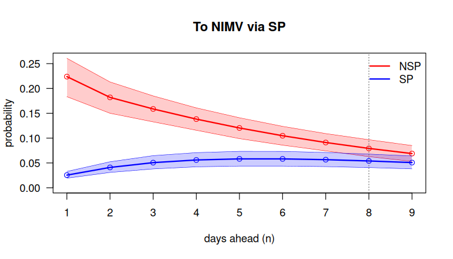

<!-- README.md is generated from README.Rmd. Please edit that file. -->

# mstate2 

[](https://github.com/jcarmezim/mstate2/actions/workflows/R-CMD-check.yaml)
[](https://codecov.io/gh/jcarmezim/mstate2)

**mstate2** implements **second-order Markov multistate models** in R.
In a first-order (Markov) model, the state at the next time depends only
on the state at the current time. In a second-order model it also
depends on the state at the **previous time**:

$$P_{hj\ell} = P(X_s = \ell \mid X_{s-1} = j,\ X_{s-2} = h).$$

This captures a short-term memory that first-order models miss: two
patients with severe pneumonia today have very different risks tomorrow
depending on whether they already had it at the previous time or have
just worsened.

The package provides nonparametric estimation, multi-step prediction,
tests of the first-order assumption, a systematic comparison with
first-order models, and covariate regression. It **complements**
[mstate](https://cran.r-project.org/package=mstate) and follows its
conventions: `msprep()`-style input, `probtrans`-style output and
`transMat` transition matrices.

## Installation

mstate2 is not yet on CRAN. Install the development version from GitHub:

``` r
# install.packages("remotes")
remotes::install_github("jcarmezim/mstate2", build_vignettes = TRUE)
```

## Example: the DIVINE cohort

The example uses the DIVINE cohort of 2076 patients hospitalised with
COVID-19 (the real-data illustration of the methods paper). The data are
not distributed with mstate2; download `MSM_Data.RData` from the [DIVINE
repository](https://github.com/bruigtp/DIVINE/tree/main/msm_data). Each
row is a patient with the days spent in each state and how follow-up
ended.

``` r
library(mstate2)
load("MSM_Data.RData")     # data frame MSM
```

**1. From sojourn times to a daily panel, and the second-order counts.**

``` r
panel <- sojourn_to_panel(MSM, id = "id",
  segments  = c(NSP = "t.nosp", SP = "t.sp", NIMV = "t.nimv", IMV = "t.mv", Recov = "t.recov"),
  absorbing = c(Disch = "disch.s", Death = "death.s"))
d <- prep2(panel, states = c("NSP", "SP", "Recov", "NIMV", "IMV", "Disch", "Death"))
d
#> <msm2data>  second-order counting processes
#>   subjects        : 2076
#>   observed triples: 23584
#>   time range      : 0 - 138
#>   states (7)      : NSP, SP, Recov, NIMV, IMV, Disch, Death
#>   absorbing       : Disch, Death
#>   distinct (h,j)  : 12
#>   covariates      : none
```

**2. Estimation.** The probability of moving from severe pneumonia (SP)
to non-invasive (NIMV) or invasive (IMV) ventilation depends strongly on
the state at the previous time (Table 2 of the paper):

``` r
fit <- P2est(d)
subset(fit$estimate, j == "SP" & l %in% c("NIMV", "IMV"))[, c("h", "j", "l", "p", "lower", "upper")]
#>      h  j    l       p   lower   upper
#> 7  NSP SP NIMV 0.22384 0.18355 0.26414
#> 8  NSP SP  IMV 0.15085 0.11625 0.18545
#> 12  SP SP NIMV 0.02549 0.01951 0.03147
#> 13  SP SP  IMV 0.01837 0.01327 0.02346
```

**3. Is the first-order assumption tenable?** Likelihood-ratio test for
each current state:

``` r
markov_test(fit, method = "lrt", by = "state")
#> <markov_test>  Likelihood-ratio test of the first-order Markov assumption (RPE-based)
#>   H0 (per current state j): P(X_s = . | X_{s-1} = j) does not depend on X_{s-2} = h
#>   4 test(s); sorted by ascending p-value
#> 
#>      j K L df statistic p.value  p.adj
#>     SP 2 5  4   357.879  0.0000 0.0000
#>   NIMV 2 4  3    47.474  0.0000 0.0000
#>  Recov 4 3  6    47.029  0.0000 0.0000
#>    IMV 3 3  4     3.494  0.4788 0.4788
```

**4. For how long does the previous time matter?** `compare2()` predicts
the probability of being in NIMV $n$ days later, for patients in SP
whose state at the previous time was NSP or SP, with subject-level
bootstrap intervals; the dotted line marks the first day on which the
intervals overlap.

``` r
bt  <- P2boot(d, B = 500, seed = 1)
cmp <- compare2(bt, h = c("NSP", "SP"), j = "SP", l = "NIMV")
summary(cmp)
#> Trajectory comparison (RPE, 95% bootstrap intervals)
#>   target 'NIMV' via current state 'SP'; preceding: NSP, SP
#>   intervals first overlap at step 8 (time s = 9); significant for the first 7 step(s).
#>   paired bootstrap test of the difference: significant for the first 9 step(s).
plot(cmp, dualaxis = FALSE, xlab = "days ahead (n)")
```



**5. How much does a first-order model get wrong?** `divergence_table()`
compares the second-order predictions with a first-order model fitted to
the same data, for every transition:

``` r
head(divergence_table(bt, P1est(bt)), 5)
#>    j    l   h  n  s separated_steps diff_steps max_abs_diff
#> 1 SP  IMV  SP NA NA               9          9      0.07966
#> 2 SP NIMV  SP NA NA               9          9      0.05486
#> 3 SP  IMV NSP  8  9               7          9      0.13461
#> 4 SP   SP NSP  5  6               4          7      0.21587
#> 5 SP NIMV NSP  4  5               3          5      0.17188
```

**6. Covariates and time scales.** A discrete-time hazard regression for
patients in SP at both the previous and the current time, with the days
already spent in SP (`d`) and the day of follow-up (`s`); `exp(coef)` is
a hazard ratio:

``` r
reg <- P2reg(d, h = "SP", j = "SP", l = c("Recov", "NIMV", "Death"), formula = ~ log(d) + s)
summary(reg)
#> <P2reg>  discrete-time cause-specific hazard regression, (h, j) = (SP, SP)
#>   link: cloglog (exp(coef) is a hazard ratio)
#>   95% CIs; model-based standard errors
#>      l        term estimate     se     HR HR.lower HR.upper p.value
#>  Recov (Intercept)  -4.0042 0.2769 0.0182   0.0106   0.0314  0.0000
#>  Recov      log(d)   1.0868 0.2090 2.9647   1.9683   4.4655  0.0000
#>  Recov           s  -0.0546 0.0178 0.9469   0.9144   0.9806  0.0022
#>   NIMV (Intercept)  -1.6131 0.2813 0.1993   0.1148   0.3458  0.0000
#>   NIMV      log(d)  -1.4091 0.3146 0.2444   0.1319   0.4527  0.0000
#>   NIMV           s   0.0134 0.0415 1.0135   0.9344   1.0993  0.7461
#>  Death (Intercept)  -3.1629 0.5588 0.0423   0.0141   0.1265  0.0000
#>  Death      log(d)   0.3488 0.7218 1.4173   0.3444   5.8332  0.6290
#>  Death           s  -0.2929 0.1303 0.7461   0.5779   0.9632  0.0246
```

## Main functions

| Task                           | Functions                                                                                                                                            |
|--------------------------------|------------------------------------------------------------------------------------------------------------------------------------------------------|
| Prepare the data               | `sojourn_to_panel()`, `from_msdata()`, `msprep2()`, `rnd()`, `prep2()`                                                                               |
| Estimate                       | `P2est()` (RPE), `P2boot()` (bootstrap), `P1est()` (first-order model from the same data)                                                            |
| Predict                        | `ckequations()` (extended Chapman-Kolmogorov), `probtrans2()` (`probtrans` format, with `plot()`)                                                    |
| Does the previous time matter? | `compare2()`, `overlap_step()`, `markov_test()` (Wald and likelihood-ratio tests)                                                                    |
| First versus second order      | `compare_order()`, `divergence()`, `divergence_table()`, `as_tmat()`                                                                                 |
| Covariates                     | `P2reg()` (discrete-time cloglog hazard regression; time-varying or semi-Markov baselines), `P2reg_all()` (covariate-adjusted multi-step prediction) |
| Simulate                       | `simulate2()`                                                                                                                                        |

## Documentation

- `vignette("mstate2")`: a complete guided analysis, function by
  function.
- `vignette("reference")`: the full reference (signature, arguments,
  value, algorithm and error conditions of every function).
- The package website: <https://jcarmezim.github.io/mstate2/>.
- `tests/DIVINE_reproduction.R` reproduces Table 2 and Section 6.3 of
  the methods paper when the DIVINE data are available.

## Methods

The estimators, their variances and the extended Chapman-Kolmogorov
relation are described in:

- Najera-Zuloaga J, Besalú M, Gómez Melis G (2025). *Second-Order Markov
  Multistate Models: Nonparametric Estimation and Inference*. Manuscript
  submitted for publication.
- Besalú M, Gómez Melis G (2024). Second order Markov multistate models.
  *SORT*, 48(2), 209–234.

The bootstrap intervals, the likelihood-ratio test, the first-order
comparison tools and the covariate regression are extensions developed
in this package; see `NEWS.md`.

## Citation

``` r
citation("mstate2")
To cite mstate2 in publications, please cite the methods paper. Citing
the package itself (below) is optional.

  Najera-Zuloaga J, Besalú M, Gómez Melis G (2025). "Second-Order
  Markov Multistate Models: Nonparametric Estimation and Inference."
  Manuscript submitted for publication.

  Carmezim J, Najera-Zuloaga J, Besalú M, Tebé C, Gómez Melis G (2026).
  mstate2: Second-Order Markov Multistate Models. R package version
  0.2.0. https://github.com/jcarmezim/mstate2

To see these entries in BibTeX format, use 'print(<citation>,
bibtex=TRUE)', 'toBibtex(.)', or set
'options(citation.bibtex.max=999)'.
```

## Authors

- **João Carmezim** (maintainer)
- Josu Najera-Zuloaga
- Mireia Besalú
- Cristian Tebé
- Guadalupe Gómez Melis

mstate2 is developed within the PhD thesis *Second-Order Markov Methods
for Multistate Survival Analysis with Application to Acute Respiratory
Infections* (Universitat Politècnica de Catalunya).

## Getting help

Please report bugs, with a minimal reproducible example, on [GitHub
Issues](https://github.com/jcarmezim/mstate2/issues).

## License

GPL (\>= 3)
