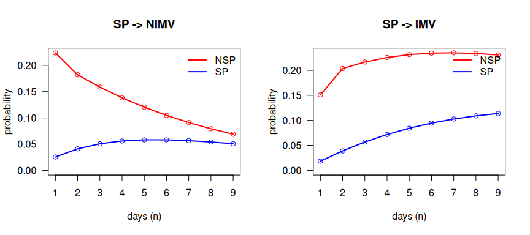
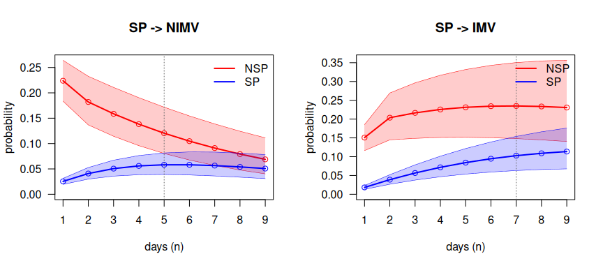
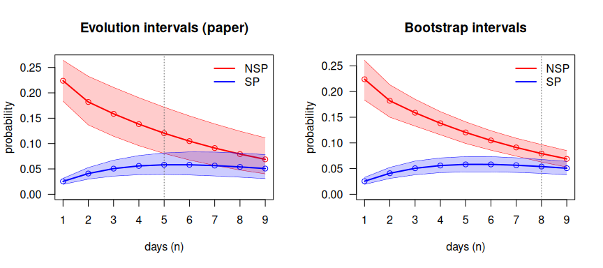

# Reproducing the DIVINE analysis of the methods paper

This vignette reproduces, step by step, the real-data analysis of

> Najera-Zuloaga, J., Besalú, M. and Gómez Melis, G. (2025).
> Second-order Markov multistate models: nonparametric estimation and
> inference. Manuscript submitted for publication.

with `mstate2`. Each step names the part of the paper it reproduces, the
function that does it and the result to compare. A final checklist
compares the package output with the published values. The general use
of every function is explained in
[`vignette("mstate2")`](https://jcarmezim.github.io/mstate2/articles/mstate2.md).

| Paper | What it shows | Function | Section here |
|----|----|----|----|
| Data | daily panel of the DIVINE cohort | [`sojourn_to_panel()`](https://jcarmezim.github.io/mstate2/reference/sojourn_to_panel.md), [`rnd()`](https://jcarmezim.github.io/mstate2/reference/rnd.md) | 2 |
| Counting processes | $`\tilde N_{hj\ell}(s)`$, $`\tilde Y_{hj}(s-1)`$ | [`prep2()`](https://jcarmezim.github.io/mstate2/reference/prep2.md) | 3 |
| Eq. 9, Theorem 5, Corollaries 1–2 | relative probability estimator (RPE), variance, CI | [`P2est()`](https://jcarmezim.github.io/mstate2/reference/P2est.md) | 4 |
| Table 2 | 1-step probabilities from severe pneumonia | [`P2est()`](https://jcarmezim.github.io/mstate2/reference/P2est.md) | 4 |
| Eq. 6 | extended Chapman–Kolmogorov relation | [`ckequations()`](https://jcarmezim.github.io/mstate2/reference/ckequations.md) | 5 |
| Section 6.3, Figures 4–5 | for how long the previous state matters | [`compare2()`](https://jcarmezim.github.io/mstate2/reference/compare2.md), [`overlap_step()`](https://jcarmezim.github.io/mstate2/reference/overlap_step.md) | 6 |
| Section 5 | simulation from a second-order model | [`simulate2()`](https://jcarmezim.github.io/mstate2/reference/simulate2.md) | 8 |

Notation: $`P_{hj\ell} = P(X_s = \ell \mid X_{s-1} = j, X_{s-2} = h)`$,
where $`h`$ is the state at the previous time, $`j`$ the state at the
current time and $`\ell`$ the state at the next time.

## 1. Data

The DIVINE cohort has 2076 patients hospitalised with COVID-19. The
multistate extract is distributed by the DIVINE project
([`msm_data/MSM_Data.RData`](https://github.com/bruigtp/DIVINE/tree/main/msm_data))
and is not included in `mstate2`: download it and load it.

``` r

library(mstate2)
library(dplyr)
load("MSM_Data.RData")          # data frame MSM, one row per patient
```

``` r

MSM |> summarise(patients = n(), discharged = sum(disch.s), died = sum(death.s))
#>   patients discharged died
#> 1     2076       1858  218
```

The states are non-severe and severe pneumonia (`NSP`, `SP`),
non-invasive and invasive mechanical ventilation (`NIMV`, `IMV`),
recovery after respiratory support (`Recov`), discharge (`Disch`) and
death (`Death`). For each patient, `MSM` records the days spent in each
state (`t.nosp`, `t.sp`, `t.nimv`, `t.mv`, `t.recov`) and how follow-up
ended (`disch.s`, `death.s`).

## 2. Step 1: the daily panel

The methods of the paper are in discrete time: one observation per
patient and day.
[`sojourn_to_panel()`](https://jcarmezim.github.io/mstate2/reference/sojourn_to_panel.md)
expands the days spent in each state into one row per day, in the
visiting order NSP → SP → NIMV → IMV → Recov, and appends the final
state.

``` r

estados <- c("NSP", "SP", "Recov", "NIMV", "IMV", "Disch", "Death")
panel <- sojourn_to_panel(MSM, id = "id",
  segments  = c(NSP = "t.nosp", SP = "t.sp", NIMV = "t.nimv", IMV = "t.mv", Recov = "t.recov"),
  absorbing = c(Disch = "disch.s", Death = "death.s"))
dim(panel)
#> [1] 27736     3
```

Durations are recorded in half days. They are rounded with
[`rnd()`](https://jcarmezim.github.io/mstate2/reference/rnd.md), which
sends 0.5 to 1. Base R’s [`round()`](https://rdrr.io/r/base/Round.html)
sends 0.5 to 0, deletes the half-day stays in severe pneumonia and does
not reproduce Table 2:

``` r

MSM |> filter(t.sp %% 1 == 0.5) |> nrow()    # half-day stays in SP
#> [1] 146
rnd(0.5); round(0.5)
#> [1] 1
#> [1] 0
```

## 3. Step 2: the second-order counting processes

[`prep2()`](https://jcarmezim.github.io/mstate2/reference/prep2.md)
forms, for every patient, the triples of consecutive days
$`(X_{s-2}, X_{s-1}, X_s) = (h, j, \ell)`$ and counts the transitions
$`\tilde N_{hj\ell}(s)`$ and the patients at risk
$`\tilde Y_{hj}(s-1)`$.

``` r

d <- prep2(panel, states = estados)
d
#> <msm2data>  second-order counting processes
#>   subjects        : 2076
#>   observed triples: 23584
#>   time range      : 0 - 138
#>   states (7)      : NSP, SP, Recov, NIMV, IMV, Disch, Death
#>   absorbing       : Disch, Death
#>   distinct (h,j)  : 12
```

The 23 584 triples are the 27 736 rows of the panel minus the first two
days of each patient, which have no complete history. The 12 histories
$`(h, j)`$ are the 5 stays in the same state and the 7 changes of state
observed in the data.

## 4. Step 3: Table 2, the relative probability estimator

The RPE (Eq. 9) pools all the transitions and all the patient-days at
risk of each history:

``` math
\hat P_{hj\ell} = \frac{\sum_s \tilde N_{hj\ell}(s)}{\sum_s \tilde Y_{hj}(s-1)},
\qquad
\mathrm{se} = \sqrt{\frac{\hat p(1-\hat p)}{\sum_s \tilde Y_{hj}(s-1)}},
```

with Wald 95% confidence intervals (Corollaries 1–2).

``` r

fit <- P2est(d)
table2 <- fit$estimate |>
  filter(j == "SP", l %in% c("NIMV", "IMV")) |>
  select(h, j, l, p, se, lower, upper, n.trans, at.risk)
table2
#>     h  j    l       p       se   lower   upper n.trans at.risk
#> 1 NSP SP NIMV 0.22384 0.020560 0.18355 0.26414      92     411
#> 2 NSP SP  IMV 0.15085 0.017654 0.11625 0.18545      62     411
#> 3  SP SP NIMV 0.02549 0.003051 0.01951 0.03147      68    2668
#> 4  SP SP  IMV 0.01837 0.002599 0.01327 0.02346      49    2668
```

**Comparison with Table 2 of the paper:**

``` r

published <- c(0.224, 0.151, 0.025, 0.018)        # NSP->NIMV, NSP->IMV, SP->NIMV, SP->IMV
table2 |>
  transmute(history = paste(h, j, sep = " -> "), to = l,
            paper = published, mstate2 = round(p, 3)) |>
  mutate(match = paper == mstate2)
#>     history   to paper mstate2 match
#> 1 NSP -> SP NIMV 0.224   0.224  TRUE
#> 2 NSP -> SP  IMV 0.151   0.151  TRUE
#> 3  SP -> SP NIMV 0.025   0.025  TRUE
#> 4  SP -> SP  IMV 0.018   0.018  TRUE
```

The four probabilities match to the three decimals published. A patient
in severe pneumonia who was in non-severe pneumonia at the previous time
(who has just worsened) moves to non-invasive ventilation the next day
with probability 0.224; one who was already in severe pneumonia, with
probability 0.025. The 95% intervals of the two histories do not
overlap, for NIMV or for IMV:

``` r

table2 |>
  group_by(to = l) |>
  summarise(separated = lower[h == "NSP"] > upper[h == "SP"])
#> # A tibble: 2 × 2
#>   to    separated
#>   <fct> <lgl>    
#> 1 NIMV  TRUE     
#> 2 IMV   TRUE
```

A first-order model, which ignores the state at the previous time, would
give the two patients the same probability.

## 5. Step 4: n-step prediction (extended Chapman–Kolmogorov)

The extended Chapman–Kolmogorov relation (Eq. 6) gives the probability
of being in each state $`n`$ days later, given the states at the
previous and the current time:
$`P_{hj\ell}(1, n) = P(X_{n+1} = \ell \mid X_1 = j, X_0 = h)`$.
[`ckequations()`](https://jcarmezim.github.io/mstate2/reference/ckequations.md)
computes it exactly by treating the pair of consecutive states as a
first-order chain.

For a patient in SP at the current time who was in NSP at the previous
time:

``` r

round(ckequations(fit, h = "NSP", j = "SP", nsteps = 9), 3)
#>       NSP    SP Recov  NIMV   IMV Disch Death
#>  [1,]   0 0.616 0.007 0.224 0.151 0.000 0.002
#>  [2,]   0 0.532 0.067 0.182 0.204 0.001 0.015
#>  [3,]   0 0.460 0.132 0.159 0.217 0.005 0.028
#>  [4,]   0 0.398 0.183 0.138 0.226 0.015 0.040
#>  [5,]   0 0.344 0.220 0.120 0.231 0.032 0.052
#>  [6,]   0 0.298 0.247 0.105 0.234 0.054 0.063
#>  [7,]   0 0.257 0.264 0.091 0.235 0.079 0.074
#>  [8,]   0 0.222 0.275 0.079 0.234 0.106 0.084
#>  [9,]   0 0.192 0.279 0.069 0.231 0.135 0.094
```

Each row is the distribution of the state on day $`n`$ and sums to 1.

## 6. Step 5: for how long does the previous state matter? (Section 6.3)

[`compare2()`](https://jcarmezim.github.io/mstate2/reference/compare2.md)
computes the $`n`$-step curves for the two histories, NSP → SP and SP →
SP, with the **evolution intervals** of the paper, obtained by
propagating the lower and upper limits of the 1-step intervals.
[`overlap_step()`](https://jcarmezim.github.io/mstate2/reference/overlap_step.md)
returns the first day on which the two intervals overlap: from then on,
the state at the previous time no longer changes the prediction
significantly.

``` r

cmp_nimv <- compare2(fit, h = c("NSP", "SP"), j = "SP", l = "NIMV", nsteps = 9)
cmp_imv  <- compare2(fit, h = c("NSP", "SP"), j = "SP", l = "IMV",  nsteps = 9)
summary(cmp_nimv)
#> Trajectory comparison (RPE, 95% evolution intervals)
#>   target 'NIMV' via current state 'SP'; preceding: NSP, SP
#>   intervals first overlap at step 5 (time s = 6); significant for the first 4 step(s).
summary(cmp_imv)
#> Trajectory comparison (RPE, 95% evolution intervals)
#>   target 'IMV' via current state 'SP'; preceding: NSP, SP
#>   intervals first overlap at step 7 (time s = 8); significant for the first 6 step(s).
```

These are the curves of Figures 4–5 of the paper. Without intervals
(`bounds = FALSE`), the two histories start far apart and converge:

``` r

op <- par(mfrow = c(1, 2))
plot(compare2(fit, c("NSP", "SP"), "SP", "NIMV", bounds = FALSE),
     dualaxis = FALSE, xlab = "days (n)", main = "SP -> NIMV")
plot(compare2(fit, c("NSP", "SP"), "SP", "IMV", bounds = FALSE),
     dualaxis = FALSE, xlab = "days (n)", main = "SP -> IMV")
```



plot of chunk figure-curves

``` r

par(op)
```

With evolution intervals; the dotted line marks the first overlap:

``` r

op <- par(mfrow = c(1, 2))
plot(cmp_nimv, dualaxis = FALSE, xlab = "days (n)", main = "SP -> NIMV")
plot(cmp_imv,  dualaxis = FALSE, xlab = "days (n)", main = "SP -> IMV")
```



plot of chunk figure-intervals

``` r

par(op)
```

``` r

tibble(target         = c("NIMV", "IMV"),
       first_overlap  = c(overlap_step(cmp_nimv)$n, overlap_step(cmp_imv)$n),
       separated_days = c(overlap_step(cmp_nimv)$separated_steps,
                          overlap_step(cmp_imv)$separated_steps))
#> # A tibble: 2 × 3
#>   target first_overlap separated_days
#>   <chr>          <int>          <int>
#> 1 NIMV               5              4
#> 2 IMV                7              6
```

The state at the previous time changes the prediction of non-invasive
ventilation for 4 days (the intervals overlap from day 5) and of
invasive ventilation for 6 days (from day 7), as reported in Section
6.3.

## 7. Beyond the paper: bootstrap intervals

The evolution intervals assume that all the probabilities are at their
lower (or upper) limit at the same time, so they are conservative and
widen with $`n`$. `mstate2` adds percentile intervals from a bootstrap
of whole patients,
[`P2boot()`](https://jcarmezim.github.io/mstate2/reference/P2boot.md).
This is **not part of the paper**; it is shown here to put the evolution
intervals in context.

``` r

bt <- P2boot(d, B = 500, seed = 1)
cmp_b <- compare2(bt, h = c("NSP", "SP"), j = "SP", l = "NIMV", nsteps = 9)
overlap_step(cmp_b)$n
#> [1] 8
```

``` r

op <- par(mfrow = c(1, 2))
plot(cmp_nimv, dualaxis = FALSE, xlab = "days (n)", main = "Evolution intervals (paper)")
plot(cmp_b,    dualaxis = FALSE, xlab = "days (n)", main = "Bootstrap intervals")
```



plot of chunk figure-boot

``` r

par(op)
```

With bootstrap intervals the two histories of SP → NIMV remain separated
for 7 days instead of 4.

## 8. Simulation from a second-order model (Section 5)

Section 5 of the paper studies the estimators on data simulated from a
second-order model, with patients entering the study at different times
(auxiliary state 0).
[`simulate2()`](https://jcarmezim.github.io/mstate2/reference/simulate2.md)
implements that mechanism: the state at entry, the first move (which has
no previous time) and every later move drawn from the tensor
$`P_{hj\ell}`$, until an absorbing state.

The design and parameters of the paper’s simulation study are given
there; here the mechanism is illustrated with the model fitted to
DIVINE. The first move is taken from the empirical day 0 → day 1
transitions:

``` r

first_moves <- inner_join(
  panel |> filter(time == 0) |> select(id, from = state),     # state at admission
  panel |> filter(time == 1) |> select(id, to = state),       # state on day 1
  by = "id")
first_mat <- first_moves |>                                    # first move (no previous time)
  count(from = factor(from, estados), to = factor(to, estados), .drop = FALSE) |>
  group_by(from) |>
  mutate(p = n / pmax(sum(n), 1)) |>
  ungroup() |>
  xtabs(formula = p ~ from + to) |>
  unclass()
init <- first_moves |>                                         # distribution at admission
  count(state = factor(from, estados), .drop = FALSE) |>
  mutate(p = n / sum(n)) |>
  pull(p, name = state)

set.seed(2025)
sim <- simulate2(20000, fit$P, first = first_mat, init = init)
fit_sim <- P2est(prep2(sim, states = estados))
bind_rows(DIVINE = fit$estimate, simulated = fit_sim$estimate, .id = "data") |>
  filter(j == "SP", l %in% c("NIMV", "IMV")) |>
  select(data, h, j, l, p) |>
  arrange(h, l, data)
#>        data   h  j    l       p
#> 1    DIVINE NSP SP NIMV 0.22384
#> 2 simulated NSP SP NIMV 0.22748
#> 3    DIVINE NSP SP  IMV 0.15085
#> 4 simulated NSP SP  IMV 0.15420
#> 5    DIVINE  SP SP NIMV 0.02549
#> 6 simulated  SP SP NIMV 0.02712
#> 7    DIVINE  SP SP  IMV 0.01837
#> 8 simulated  SP SP  IMV 0.01943
```

With a large simulated cohort, the RPE recovers the probabilities of the
model it was simulated from. Staggered entry is obtained with the
argument `entry` (see
[`?simulate2`](https://jcarmezim.github.io/mstate2/reference/simulate2.md)).

## 9. Checklist

| Result                                              | Paper | `mstate2` |
|-----------------------------------------------------|-------|-----------|
| P(NSP → SP → NIMV)                                  | 0.224 | 0.224     |
| P(NSP → SP → IMV)                                   | 0.151 | 0.151     |
| P(SP → SP → NIMV)                                   | 0.025 | 0.025     |
| P(SP → SP → IMV)                                    | 0.018 | 0.018     |
| First overlap of the evolution intervals, SP → NIMV | day 5 | day 5     |
| First overlap of the evolution intervals, SP → IMV  | day 7 | day 7     |

The same checks run as a script in `tests/DIVINE_reproduction.R`
whenever the DIVINE data are available.

## References

Najera-Zuloaga, J., Besalú, M. and Gómez Melis, G. (2025). Second-order
Markov multistate models: nonparametric estimation and inference.
Manuscript submitted for publication.

Besalú, M. and Gómez Melis, G. (2024). Second order Markov multistate
models. *SORT*, 48(2), 209–234.
