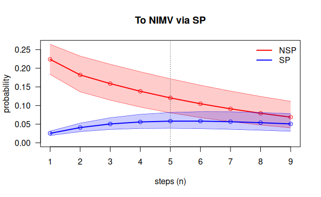

# mstate2 function reference

This document is the complete reference for `mstate2`. The package
implements the methods of Najera-Zuloaga, Besalú and Gómez Melis (2025)
and adds subject-level bootstrap intervals for the predictions. The
document lists every exported function, every S3 method, every object
class and the internal helpers, each with the same structure:

- **Definition**: the exact signature, with default values.
- **What it does**: its purpose in one paragraph.
- **Arguments**: every argument, its default and its meaning.
- **Value**: what is returned, including every component of the object.
- **How it works**: the algorithm and formulas.
- **Errors and warnings**: every condition the function checks.
- **Example**: an example on the DIVINE cohort.

For a guided analysis that uses all these functions together, see
[`vignette("mstate2")`](https://jcarmezim.github.io/mstate2/articles/mstate2.md).

## Notation and conventions

| Symbol | Meaning |
|----|----|
| $`X_s`$ | state occupied at discrete time $`s`$ |
| $`h, j, \ell`$ | state at the previous time ($`X_{s-2}`$), at the current time ($`X_{s-1}`$) and at the next time ($`X_s`$) |
| $`P_{hj\ell}`$ | $`P(X_s = \ell \mid X_{s-1} = j, X_{s-2} = h)`$, the 1-step second-order transition probability |
| $`\tilde N_{hj\ell}(s)`$ | number of subjects observed going $`h \to j \to \ell`$, arriving in $`\ell`$ at $`s`$ |
| $`\tilde Y_{hj}(s-1)`$ | number of subjects at risk: in $`h`$ at $`s-2`$ and in $`j`$ at $`s-1`$; equals $`\sum_\ell \tilde N_{hj\ell}(s)`$ |
| $`P_{hj\ell}(1, n)`$ | $`P(X_{n+1} = \ell \mid X_1 = j, X_0 = h)`$, the $`n`$-step probability |

Conventions used throughout the package:

- **Tensor layout.** Second-order probabilities are stored in an
  $`M \times M \times M`$ array indexed `P[j, l, h]` = $`P_{hj\ell}`$:
  rows = state at the current time, columns = state at the next time,
  slices = state at the previous time. Each slice `P[, , h]` is an
  ordinary transition matrix.
- **States by label or index.** Arguments `h`, `j`, `l` accept either
  state labels or integer positions in the state space.
- **Steps and time.** A prediction of $`n`$ steps starts from
  $`X_0 = h`$, $`X_1 = j`$ and refers to time $`s = n + 1`$.
- **Absorbing states** satisfy `P[a, a, h] = 1` for every `h`.
- **Tables and arrays.** Data handling uses the tidyverse (`dplyr`,
  `tidyr`, `purrr`, `tibble`) and every table is returned as a tibble.
  The tensors and the Chapman–Kolmogorov propagation are plain arrays
  and matrices, because they are linear algebra.

### Example data used in this document

All the examples use the DIVINE cohort of 2076 patients hospitalised
with COVID-19 (Najera-Zuloaga, Besalú and Gómez Melis, 2025). The data
are distributed by the DIVINE project
([`msm_data/MSM_Data.RData`](https://github.com/bruigtp/DIVINE/tree/main/msm_data))
and are not included in `mstate2`. `MSM` has one row per patient with
the state at admission (`inistat`: 1 = `NSP`, 2 = `SP`), the days spent
in each state and the 0/1 indicators of discharge and death. The states
are non-severe and severe pneumonia (`NSP`, `SP`), non-invasive and
invasive ventilation (`NIMV`, `IMV`), recovery (`Recov`), discharge
(`Disch`) and death (`Death`).

``` r

library(mstate2)
library(dplyr)
load("MSM_Data.RData")
```

``` r

estados <- c("NSP", "SP", "Recov", "NIMV", "IMV", "Disch", "Death")
segs    <- c(NSP = "t.nosp", SP = "t.sp", NIMV = "t.nimv", IMV = "t.mv", Recov = "t.recov")
absb    <- c(Disch = "disch.s", Death = "death.s")
dim(MSM)
#> [1] 2076    9
```

## Data preparation

### `rnd()`

**Definition**

``` r

rnd(x)
```

**What it does.** Rounds numbers to the nearest integer, sending halves
**away from zero** (0.5 → 1, 2.5 → 3, −0.5 → −1). It is the default
discretisation of
[`sojourn_to_panel()`](https://jcarmezim.github.io/mstate2/reference/sojourn_to_panel.md)
and the same function, with the same name, that the code of the methods
paper uses to turn the DIVINE sojourn times into days.

**Arguments**

| Argument | Default | Meaning        |
|----------|---------|----------------|
| `x`      | —       | numeric vector |

**Value.** A numeric vector of the same length:
`trunc(x + sign(x) * 0.5)`.

**How it works.** Adding $`\pm 0.5`$ in the direction of the sign and
truncating towards zero. Base R’s
[`round()`](https://rdrr.io/r/base/Round.html) instead sends halves to
the nearest *even* integer (IEC 60559), so `round(0.5) = 0` would make a
half-day stay vanish. Only
[`rnd()`](https://jcarmezim.github.io/mstate2/reference/rnd.md)
reproduces Table 2 of the paper.

**Errors and warnings.** None.

**Example**

``` r

rnd(c(-2.5, -0.5, 0.4, 0.5, 1.5, 2.5))
#> [1] -3 -1  0  1  2  3
round(c(-2.5, -0.5, 0.4, 0.5, 1.5, 2.5))
#> [1] -2  0  0  0  2  2
MSM |> filter(t.sp %% 1 == 0.5) |> nrow()   # half-day stays in severe pneumonia
#> [1] 146
```

### `sojourn_to_panel()`

**Definition**

``` r

sojourn_to_panel(data, id, segments, absorbing, round_fun = rnd)
```

**What it does.** Converts **sojourn-time data** (one row per subject,
with the total time spent in each state and indicators of how follow-up
ended) into a discrete-time **panel** (one row per subject and time
unit, with the state occupied).

**Arguments**

| Argument | Default | Meaning |
|----|----|----|
| `data` | — | data frame, one row per subject |
| `id` | — | name of the subject id column |
| `segments` | — | named character vector, `c(state = "duration column", ...)`, **in visiting order** |
| `absorbing` | — | named character vector, `c(state = "0/1 indicator column", ...)` |
| `round_fun` | `rnd` | function used to discretise durations |

**Value.** A tibble with columns `id`, `time` (0, 1, 2, …) and `state`
(character).

**How it works.** For each subject:

1.  The duration columns are put in long format (one row per subject and
    state,
    [`tidyr::pivot_longer()`](https://tidyr.tidyverse.org/reference/pivot_longer.html))
    and discretised with `round_fun`; negative or `NA` durations become
    0 (“not visited”).
2.  Each state is repeated as many times as its duration
    ([`tidyr::uncount()`](https://tidyr.tidyverse.org/reference/uncount.html)),
    in the order of `segments`.
3.  The first absorbing state whose indicator equals 1 is appended. If
    none equals 1, the subject is right-censored and has no final
    absorbing row.
4.  Times are numbered from 0. Subjects with no duration and no event
    contribute no rows. Subjects keep the row order of `data`.

This is the discretisation of the paper’s code, which also rounds each
sojourn separately with
[`rnd()`](https://jcarmezim.github.io/mstate2/reference/rnd.md).

**Errors and warnings.** Error if `data` is not a data frame, or if any
column named in `id`, `segments` or `absorbing` is missing. Warning if a
positive duration rounds to 0 time units: that visit is dropped, and
with it the transitions into and out of it (A → B → C would become A →
C). The warning gives the number of visits lost by state. It never
happens in DIVINE, whose durations are whole or half days.

**Caveat.** The order of visits and repeated visits cannot be recovered
from sojourn times: the order is imposed by `segments` and each state is
visited at most once.

**Example**

``` r

panel <- sojourn_to_panel(MSM, id = "id", segments = segs, absorbing = absb)
dim(panel)
#> [1] 27736     3
count(panel, state)         # patient-days in each state
#> # A tibble: 7 × 2
#>   state     n
#>   <chr> <int>
#> 1 Death   218
#> 2 Disch  1858
#> 3 IMV    4681
#> 4 NIMV   1019
#> 5 NSP   12432
#> 6 Recov  4228
#> 7 SP     3300
```

Every DIVINE patient ends in `Disch` or `Death`, so no follow-up is
censored.

### `msprep2()`

**Definition**

``` r

msprep2(data, id = "id", format = c("auto", "events", "wide", "sojourn", "msdata"),
        time = "time", state = "state", times = NULL, status = NULL,
        durations = NULL, outcome = NULL, initial = NULL, start = NULL, end = NULL,
        unit = 1, round_fun = rnd, recode = NULL, states = NULL, absorbing = NULL,
        trans = NULL, ties = c("last", "first"), check = c("warn", "error"), keep = NULL)
```

**What it does.** Turns multistate data **as they are collected** into
the daily panel of
[`prep2()`](https://jcarmezim.github.io/mstate2/reference/prep2.md), and
reports every record it had to drop or change. It plays the role of
[`mstate::msprep()`](https://rdrr.io/pkg/mstate/man/msprep.html), which
only takes the wide layout, needs the transition matrix, works with
numeric times and returns the counting-process format of the Cox model.

**Arguments**

| Argument | Default | Meaning |
|----|----|----|
| `data` | — | raw data (a data frame, or an `msdata` object) |
| `id` | `"id"` | subject id column |
| `format` | `"auto"` | input layout (below); `"auto"` chooses it from the arguments given |
| `time`, `state` | `"time"`, `"state"` | events layout: time (or date) and state columns |
| `times` | `NULL` | wide layout: named vector `c(state = "time column")` |
| `status` | `NULL` | wide layout: named vector `c(state = "0/1 status column")`; times with status 0 are censoring times, as in `msprep()` |
| `durations` | `NULL` | sojourn layout: named vector `c(state = "duration column")`, in visiting order |
| `outcome` | `NULL` | sojourn layout: named vector `c(state = "0/1 indicator")` of the absorbing states |
| `initial` | `NULL` | state entered at the origin: a column or a single label; with a list of states, the state without columns |
| `start` | `NULL` | origin of time: a column (e.g. admission date) or a value; default the first record (0 for a numeric wide layout) |
| `end` | `NULL` | end of follow-up of subjects not absorbed: a column or a value |
| `unit` | `1` | length of a time unit: a number, or `"hour"`, `"day"`, `"week"`, `"month"`, `"year"` for dates |
| `round_fun` | `rnd` | discretisation of the elapsed times |
| `recode` | `NULL` | relabelling of the recorded states, `c(old = "new")` |
| `states` | `NULL` | state space and order (default from `trans`, the layout, or the observed states), or a named list with the time and status columns of each state |
| `absorbing` | `NULL` | absorbing states; default from `trans`, `outcome`, or the states nobody leaves |
| `trans` | `NULL` | allowed transitions: text `c("Tx -> PR -> RelDeath", "Tx -> RelDeath")`, a list of destinations `list(Tx = c("PR", "RelDeath"), PR = "RelDeath", RelDeath = NULL)`, or a matrix ([`mstate::transMat()`](https://rdrr.io/pkg/mstate/man/transMat.html), logical or 0/1); gives the absorbing states |
| `ties` | `"last"` | state kept when several fall in the same unit (an absorbing state always wins) |
| `check` | `"warn"` | `"error"` stops at a transition not allowed by `trans` |
| `keep` | `NULL` | baseline covariates carried into the panel; with conventional names, every other column |

**Input layouts**

| Layout | One row per | Arguments |
|----|----|----|
| `events` | subject and recorded state (state changes or repeated observations) | `time`, `state` |
| `wide` | subject, one time (and status) column per state | `times`, `status` |
| `sojourn` | subject, days spent in each state and indicators of the outcome | `durations`, `outcome` |
| `msdata` | subject and possible transition ([`mstate::msprep()`](https://rdrr.io/pkg/mstate/man/msprep.html)) | — |

**Conventional names.** In the wide layout with columns `<state>_time`
and `<state>_status` for every state, `inistat` (initial state) and
`id`, no argument is needed: the states are the `<state>` prefixes in
column order, `inistat` is the initial state, every other column is kept
as a covariate, and without `id` the rows are numbered.

**Any column names: a list of states.** `states` can also be a named
list that gives, in order, the time and status columns of each state:
`list(healthy = NULL, ill = c(time = "t_ill", status = "ill"), dead = c(time = "t_dth", status = "dth"))`.
Each element can be `Surv(time, status)` (columns without quotes,
evaluated on the data: expressions allowed, times numeric or dates,
status checked by
[`survival::Surv()`](https://rdrr.io/pkg/survival/man/Surv.html)),
`c(time = , status = )` in any order, `c(time_col = "status_col")`, two
unnamed columns (the 0/1 one is the status), a single time column (no
status: visited when its time is recorded) or `NULL` (a state only
entered as initial state). The other columns are kept as covariates, as
with conventional names.

**Value.** An object of class **`msm2prep`**, a list with:

| Component | Content |
|----|----|
| `panel` | tibble `(id, time, state, keep…)`: one row per subject and unit, `time` from the origin, `state` a factor with levels `states` |
| `states`, `absorbing` | state space and absorbing states |
| `trans` | logical matrix of allowed transitions, or `NULL` |
| `transitions` | tibble `(from, to, n, allowed)` with the observed transitions |
| `subjects` | tibble with first and last unit, entry and exit state and `status` (`"absorbed"` or `"censored"`) of each subject |
| `issues` | tibble `(id, issue, state, time, detail)`: every record dropped or changed |
| `settings` | layout, unit and tie rule |

[`print()`](https://rdrr.io/r/base/print.html) shows a short report and
[`summary()`](https://rdrr.io/r/base/summary.html) the table of
transitions (from × to, as
[`mstate::events()`](https://rdrr.io/pkg/mstate/man/events.html)), the
follow-up and the issues by type.
[`prep2()`](https://jcarmezim.github.io/mstate2/reference/prep2.md)
accepts the object directly.

**How it works.**

1.  Each layout is read into the same intermediate form: one record per
    subject and recorded state, with its time. Text dates are read with
    the formats `2020-03-15`, `15/03/2020`, `15-03-2020` and
    `2020/03/15`; states are relabelled with `recode`; the `initial`
    state is added at the origin.
2.  Times are measured from the subject’s origin in units of `unit` and
    rounded with `round_fun`.
3.  Records before the origin or after the end of follow-up are dropped.
4.  In time order, the first absorbing state ends follow-up; later
    records are dropped.
5.  When several records fall in the same unit, the last (or first) is
    kept; an absorbing state is always kept. A different state that
    loses this way occupies no unit and its transitions are lost.
6.  Repeated records of the same state are merged (they are
    observations, not transitions), but still extend follow-up.
7.  Each state is expanded over the units it occupies: until the unit
    before the next state; the last state until the end of follow-up
    (`end`, the last record, or one unit if absorbing).
8.  The observed transitions are counted and checked against `trans`.

**Errors and warnings.** Error if a column is missing, if a recorded
state is not in `states`, if the wide or sojourn layout has duplicated
ids, if text times cannot be read as dates, if `unit` is a name with
numeric times, or if `check = "error"` and a transition is not allowed.
One warning gives the number of records dropped or changed, by type:

| Issue             | Meaning                                                |
|-------------------|--------------------------------------------------------|
| `missing`         | missing id, time or state (events layout)              |
| `before_start`    | record before the origin                               |
| `after_end`       | record after the end of follow-up                      |
| `after_absorbing` | record after the entry into an absorbing state         |
| `same_unit`       | another state was kept in the same time unit           |
| `rounded_to_zero` | a positive duration rounds to 0 units (sojourn layout) |
| `not_allowed`     | transition not allowed by `trans` (kept)               |
| `no_data`         | subject with no usable record                          |

**Example**

``` r

x <- msprep2(MSM, durations = segs, outcome = absb, states = estados)
x
#> <msm2prep>  discrete-time panel ready for prep2()
#>   layout          : sojourn
#>   subjects        : 2076 (2076 absorbed, 0 censored)
#>   panel rows      : 27736 (time 0 - 138)
#>   states (7)      : NSP, SP, Recov, NIMV, IMV, Disch, Death
#>   absorbing       : Disch, Death
#>   transitions     : 14 types, 3433 in total
#>   issues          : none
summary(x)
#> <msm2prep summary>
#> 
#> Observed transitions (from rows to columns):
#>        to
#> from     NSP   SP Recov NIMV  IMV Disch Death
#>   NSP      0  411     0    0    0  1406    38
#>   SP       0    0   223  214  166     0    29
#>   Recov    0    0     0    0    0   452    12
#>   NIMV     0    0   101    0  102     0    11
#>   IMV      0    0   140    0    0     0   128
#>   Disch    0    0     0    0    0     0     0
#>   Death    0    0     0    0    0     0     0
#> 
#> Time units of follow-up by status:
#> # A tibble: 1 × 5
#>   status   subjects   min median   max
#>   <chr>       <int> <dbl>  <dbl> <dbl>
#> 1 absorbed     2076     2      9   139
#> 
#> Records dropped or changed:
#>   none
all.equal(x$panel |> mutate(state = as.character(state)), panel)   # = sojourn_to_panel()
#> [1] TRUE
```

### `prep2()`

**Definition**

``` r

prep2(data, id = "id", time = "time", state = "state",
      states = NULL, absorbing = NULL, drop.na = FALSE, check.consecutive = TRUE)
```

**What it does.** Builds the **second-order counting processes**
$`\tilde N_{hj\ell}(s)`$ and $`\tilde Y_{hj}(s-1)`$ from panel data,
plus the individual-level table of second-order triples. Its output is
the input of
[`P2est()`](https://jcarmezim.github.io/mstate2/reference/P2est.md) and
[`P2boot()`](https://jcarmezim.github.io/mstate2/reference/P2boot.md).

**Arguments**

| Argument | Default | Meaning |
|----|----|----|
| `data` | — | panel data frame (one row per subject and time), or an `msm2prep` object from [`msprep2()`](https://jcarmezim.github.io/mstate2/reference/msprep2.md) (its panel, states and absorbing states are used) |
| `id`, `time`, `state` | `"id"`, `"time"`, `"state"` | column names |
| `states` | `NULL` | state space **and order**; default: observed states (factor levels, or sorted values) |
| `absorbing` | `NULL` | absorbing states; default: inferred |
| `drop.na` | `FALSE` | if `TRUE`, drop rows with `NA` in id/time/state with a warning instead of an error |
| `check.consecutive` | `TRUE` | warn when some subject’s times are not consecutive integers |

**Value.** An object of class **`msm2data`**, a list with:

| Component | Content |
|----|----|
| `N` | tibble `(h, j, l, s, N)`: $`\tilde N_{hj\ell}(s)`$, $`s`$ = time of the destination |
| `Y` | tibble `(h, j, s, Y)`: $`\tilde Y_{hj}(s-1)`$, indexed by the same $`s`$ |
| `triples` | tibble `(id, h, j, l, s)`: one row per subject per at-risk instant; used by [`P2boot()`](https://jcarmezim.github.io/mstate2/reference/P2boot.md) to resample subjects |
| `states` | the state space, in order |
| `absorbing` | absorbing states (character) |
| `n` | number of subjects |
| `ntriples` | number of triples (rows of `triples`) |
| `time.range` | range of observed times |

The columns `h`, `j`, `l` are factors with levels `states`.

**How it works.**

1.  Validates the columns and `NA`s and renames them to `id`, `time`,
    `state`. Converts `state` to a factor with levels `states`.
2.  Sorts by `(id, time)` and, if requested, checks that times within
    each subject increase by exactly 1.
3.  Within each subject, `h = lag(state, 2)` and `j = lag(state, 1)`.
    The first two rows of each subject (incomplete history) are dropped;
    the remaining rows are the triples, with the current row’s state as
    `l`.
4.  `N` counts triples by `(h, j, l, s)`
    ([`count()`](https://dplyr.tidyverse.org/reference/count.html)); `Y`
    sums `N` over `l`. These are the counting processes of Section 2.2
    of the paper. With complete follow-up,
    $`\sum_\ell \tilde N_{hj\ell}(s)`$ is exactly the number of subjects
    in $`h`$ at $`s-2`$ and $`j`$ at $`s-1`$; a subject whose follow-up
    stops in $`j`$ (right-censored) is not counted at risk, because its
    next state is not observed.
5.  If `absorbing` is `NULL`, a state is absorbing when it is occupied
    but never left ($`j \to \ell`$ with $`\ell \ne j`$ never observed).

**Why it is done this way.** The likelihood of a second-order Markov
chain depends on the data only through $`\tilde N_{hj\ell}`$ and
$`\tilde Y_{hj}`$ (Anderson and Goodman, 1957), so they are computed
once and every other function reuses them.

**Errors and warnings.**

- Error: a column in `id`/`time`/`state` is missing.
- Error: `NA` in id/time/state with `drop.na = FALSE` (warning and drop
  with `drop.na = TRUE`).
- Error: an observed state is not in `states`.
- Error: no triples at all (every subject has fewer than 3
  observations).
- Warning: non-consecutive times (triples are still formed from
  consecutive **rows**).

**Example**

``` r

d <- prep2(panel, states = estados)
d
#> <msm2data>  second-order counting processes
#>   subjects        : 2076
#>   observed triples: 23584
#>   time range      : 0 - 138
#>   states (7)      : NSP, SP, Recov, NIMV, IMV, Disch, Death
#>   absorbing       : Disch, Death
#>   distinct (h,j)  : 12
head(d$N)
#> # A tibble: 6 × 5
#>   h     j     l         s     N
#>   <fct> <fct> <fct> <int> <int>
#> 1 NSP   NSP   NSP       2  1505
#> 2 NSP   NSP   NSP       3  1306
#> 3 NSP   NSP   NSP       4  1147
#> 4 NSP   NSP   NSP       5   955
#> 5 NSP   NSP   NSP       6   788
#> 6 NSP   NSP   NSP       7   610
head(d$Y)
#> # A tibble: 6 × 4
#>   h     j         s     Y
#>   <fct> <fct> <int> <int>
#> 1 NSP   NSP       2  1658
#> 2 NSP   NSP       3  1505
#> 3 NSP   NSP       4  1306
#> 4 NSP   NSP       5  1147
#> 5 NSP   NSP       6   955
#> 6 NSP   NSP       7   788
names(d$triples)      # one row per patient-day at risk (not printed)
#> [1] "id" "h"  "j"  "l"  "s"
```

### `print.msm2data()` and `summary.msm2data()`

**Definition**

``` r

## S3 method for class 'msm2data'
print(x, ...)
## S3 method for class 'msm2data'
summary(object, ...)
```

**What they do.** [`print()`](https://rdrr.io/r/base/print.html) shows
the number of subjects and triples, time range, states, absorbing states
and number of distinct $`(h, j)`$ pairs.
[`summary()`](https://rdrr.io/r/base/summary.html) prints and invisibly
returns the **exposure per $`(h, j)`$ pair**.

**Value.** [`print()`](https://rdrr.io/r/base/print.html) returns `x`
invisibly. [`summary()`](https://rdrr.io/r/base/summary.html) returns
invisibly a tibble with one row per $`(h, j)`$ and columns
`total_at_risk` ($`\sum_s \tilde Y_{hj}(s-1)`$, the RPE denominator, in
subject-instants), `s_min` and `s_max`.

**Example**

``` r

expo <- summary(d)
#> <msm2data summary>
#>   2076 subjects, 23584 triples, time 0-138
#>   exposure per (h, j) pair:
#> # A tibble: 12 × 5
#>    h     j     total_at_risk s_min s_max
#>    <fct> <fct>         <int> <int> <int>
#>  1 NSP   NSP           10577     2    43
#>  2 NSP   SP              411     2    37
#>  3 SP    SP             2668     2    50
#>  4 SP    Recov           223     3    51
#>  5 SP    NIMV            214     2    37
#>  6 SP    IMV             166     2    38
#>  7 Recov Recov          3764     4   138
#>  8 NIMV  Recov           101     3    36
#>  9 NIMV  NIMV            805     3    41
#> 10 NIMV  IMV             102     3    21
#> 11 IMV   Recov           140     4    97
#> 12 IMV   IMV            4413     3    96
```

## Estimation

### `P2est()`

**Definition**

``` r

P2est(object, conf.level = 0.95, ci = c("wald", "logit"), clip = TRUE)
```

**What it does.** Estimates every observed 1-step second-order
transition probability $`P_{hj\ell}`$ nonparametrically, with standard
errors and confidence intervals, with the relative probability estimator
(RPE), and arranges them as tensors.

**Arguments**

| Argument     | Default  | Meaning                              |
|--------------|----------|--------------------------------------|
| `object`     | —        | an `msm2data` object                 |
| `conf.level` | `0.95`   | confidence level, strictly in (0, 1) |
| `ci`         | `"wald"` | `"wald"` or `"logit"` interval       |
| `clip`       | `TRUE`   | truncate Wald intervals to \[0, 1\]  |

**Value.** An object of class **`P2est`**, a list with:

| Component | Content |
|----|----|
| `estimate` | tibble, one row per observed $`(h, j, \ell)`$: `h, j, l, p, se, lower, upper, n.trans, at.risk` |
| `P` | $`M \times M \times M`$ tensor of estimates, layout `[j, l, h]` (as in the paper’s code) |
| `P.lower`, `P.upper` | tensors of the confidence limits |
| `P.se` | tensor of standard errors |
| `states`, `absorbing` | state space and absorbing states |
| `estimator` (always `"RPE"`), `conf.level`, `ci` | settings used |
| `n` | number of subjects |

with `n.trans` $`= \sum_s \tilde N_{hj\ell}(s)`$ and `at.risk`
$`= \sum_s \tilde Y_{hj}(s-1)`$.

**How it works.**

``` math
\tilde P_{hj\ell} = \frac{\sum_s \tilde N_{hj\ell}(s)}{\sum_s \tilde Y_{hj}(s-1)},
\qquad
\mathrm{se} = \sqrt{\frac{\tilde P_{hj\ell}(1-\tilde P_{hj\ell})}{\sum_s \tilde Y_{hj}(s-1)}}.
```

The estimator is Eq. 9 of the paper; the standard error is
$`\tilde\varsigma_{hj\ell}/\sqrt{n}`$, with the variance estimator of
Theorem 5 (Eq. 14), because
$`\hat\pi_{hj}(s-1) = \tilde Y_{hj}(s-1)/n`$. The RPE pools all exposure
and weighs every subject-instant equally (the paper shows, Corollary 3,
that it is more efficient than the conditional probability estimator,
which is therefore not implemented). Intervals: Wald
$`\tilde P \pm z\,\mathrm{se}`$ (Corollary 2; clipped if `clip`, as in
the paper’s code), or logit
$`\mathrm{expit}(\mathrm{logit}\,\hat p \pm z\,\mathrm{se}/(\hat p(1-\hat p)))`$,
which degenerates to $`[\hat p, \hat p]`$ when $`\hat p \in \{0, 1\}`$.
Finally, for every absorbing state $`a`$ and every $`h`$, `P[a, a, h]`,
`P.lower[a, a, h]` and `P.upper[a, a, h]` are set to 1, so that
absorbing states keep their probability mass during propagation.
Unobserved $`(h, j)`$ pairs are left at 0, as the paper prescribes when
nobody is at risk.

**Agreement with the paper’s code.** On DIVINE, the 343 entries of `P`
coincide with the tensor of the paper’s illustration code. The only
differences are (i) $`z`$ is computed exactly (`qnorm(0.975)` =
1.959964, against 1.96 in the paper’s code), which changes the
confidence limits by about $`10^{-6}`$, and (ii) `P[a, a, h] = 1` also
for pairs $`(h, a)`$ that never occur (e.g. SP → Disch), which the
paper’s code leaves at 0; those pairs have probability 0 of being
reached, so no prediction changes.

**Errors and warnings.** Error if `object` is not an `msm2data` or if
`conf.level` is not a single number strictly between 0 and 1.

**Example**

``` r

fit <- P2est(d)
fit
#> <P2est>  RPE estimates of 1-step second-order transition probabilities
#>   states: NSP, SP, Recov, NIMV, IMV, Disch, Death
#>   95% wald confidence intervals; 2076 subjects
#>   39 estimated transition probabilities (h -> j -> l)
fit$estimate |> filter(j == "SP")             # Table 2 of the paper
#> # A tibble: 10 × 9
#>    h     j     l           p      se   lower   upper n.trans at.risk
#>    <fct> <fct> <fct>   <dbl>   <dbl>   <dbl>   <dbl>   <int>   <int>
#>  1 NSP   SP    SP    0.616   0.0240  0.569   0.663       253     411
#>  2 NSP   SP    Recov 0.00730 0.00420 0       0.0155        3     411
#>  3 NSP   SP    NIMV  0.224   0.0206  0.184   0.264        92     411
#>  4 NSP   SP    IMV   0.151   0.0177  0.116   0.185        62     411
#>  5 NSP   SP    Death 0.00243 0.00243 0       0.00720       1     411
#>  6 SP    SP    SP    0.865   0.00662 0.852   0.878      2307    2668
#>  7 SP    SP    Recov 0.0825  0.00533 0.0720  0.0929      220    2668
#>  8 SP    SP    NIMV  0.0255  0.00305 0.0195  0.0315       68    2668
#>  9 SP    SP    IMV   0.0184  0.00260 0.0133  0.0235       49    2668
#> 10 SP    SP    Death 0.00900 0.00183 0.00541 0.0126       24    2668
round(fit$P[, , "NSP"], 3)     # transition matrix for patients in NSP at the previous time
#>         NSP    SP Recov  NIMV   IMV Disch Death
#> NSP   0.843 0.024 0.000 0.000 0.000 0.129 0.003
#> SP    0.000 0.616 0.007 0.224 0.151 0.000 0.002
#> Recov 0.000 0.000 0.000 0.000 0.000 0.000 0.000
#> NIMV  0.000 0.000 0.000 0.000 0.000 0.000 0.000
#> IMV   0.000 0.000 0.000 0.000 0.000 0.000 0.000
#> Disch 0.000 0.000 0.000 0.000 0.000 1.000 0.000
#> Death 0.000 0.000 0.000 0.000 0.000 0.000 1.000
```

### `print.P2est()`

**Definition**

``` r

## S3 method for class 'P2est'
print(x, ...)
```

**What it does.** Prints the estimator, states, interval type and level,
number of subjects and number of estimated probabilities. Returns `x`
invisibly. The estimates themselves are in `x$estimate`.

### `P2boot()`

**Definition**

``` r

P2boot(object, B = 200, conf.level = 0.95, seed = NULL)
```

**What it does.** Subject-level bootstrap of the RPE: resamples subjects
with replacement and recomputes every $`\hat P_{hj\ell}`$ in each
replicate. The result behaves like a `P2est` fit;
[`ckequations()`](https://jcarmezim.github.io/mstate2/reference/ckequations.md)
and
[`compare2()`](https://jcarmezim.github.io/mstate2/reference/compare2.md)
then use **percentile bootstrap intervals** for the $`n`$-step
probabilities instead of the evolution intervals.

**Arguments**

| Argument     | Default | Meaning                                   |
|--------------|---------|-------------------------------------------|
| `object`     | —       | an `msm2data` object                      |
| `B`          | `200`   | number of replicates (at least 2)         |
| `conf.level` | `0.95`  | confidence level of the intervals         |
| `seed`       | `NULL`  | optional seed for reproducible replicates |

**Value.** An object of class **`c("P2boot", "P2est")`**: every
component of `P2est(object)`, plus `boot`
($`M \times M \times M \times B`$ array of replicate tensors, layout
`[j, l, h, b]`), `B`, and a column `se.boot` (bootstrap SD) in
`estimate`.

**How it works.** The per-subject counts of every observed
$`(h, j, \ell)`$ triple are tabulated once (an $`n \times K`$ matrix). A
replicate draws subject multiplicities $`w`$ and computes the totals
$`w^\top C`$, from which the RPE tensor follows by grouped sums; pairs
with nobody at risk in a replicate keep the point-estimate row, and
absorbing states keep probability 1. For an $`n`$-step band, each
replicate tensor is propagated with the pair-chain machinery and the
$`\alpha/2`$ and $`1-\alpha/2`$ quantiles are taken step by step.
Resampling subjects keeps their within-subject dependence.

**Why it is done this way.** Patients are the independent units and
their days are not, so whole patients are resampled: the standard
non-parametric bootstrap for clustered data (Davison and Hinkley, 1997;
Field and Welsh, 2007). The $`n`$-step predictions are non-linear
functions of all the estimated probabilities, so propagating each
replicate and taking percentiles (Efron and Tibshirani, 1993) is simpler
and more reliable than a delta-method variance. In the package’s
simulation study, 95% percentile intervals of $`n`$-step predictions had
coverage 0.91 to 0.94, while the evolution intervals had coverage 1 and
were up to five times wider.

**Errors and warnings.** Error if `object` is not an `msm2data`, if
`B < 2` or if `conf.level` is not in (0, 1).

**Example**

``` r

bt <- P2boot(d, B = 500, seed = 1)
bt
#> <P2boot>  RPE estimates with 500 subject-level bootstrap replicates
#>   states: NSP, SP, Recov, NIMV, IMV, Disch, Death
#>   95% percentile intervals for n-step predictions; 2076 subjects
#>   39 estimated transition probabilities (h -> j -> l)
bt$estimate |> filter(j == "SP") |> select(h, l, p, se, se.boot)
#> # A tibble: 10 × 5
#>    h     l           p      se se.boot
#>    <fct> <fct>   <dbl>   <dbl>   <dbl>
#>  1 NSP   SP    0.616   0.0240  0.0244 
#>  2 NSP   Recov 0.00730 0.00420 0.00419
#>  3 NSP   NIMV  0.224   0.0206  0.0198 
#>  4 NSP   IMV   0.151   0.0177  0.0180 
#>  5 NSP   Death 0.00243 0.00243 0.00238
#>  6 SP    SP    0.865   0.00662 0.00736
#>  7 SP    Recov 0.0825  0.00533 0.00430
#>  8 SP    NIMV  0.0255  0.00305 0.00347
#>  9 SP    IMV   0.0184  0.00260 0.00275
#> 10 SP    Death 0.00900 0.00183 0.00199
ckequations(bt, h = "NSP", j = "SP", l = "NIMV", nsteps = 5, bounds = TRUE)
#> # A tibble: 5 × 4
#>       n estimate  lower upper
#>   <int>    <dbl>  <dbl> <dbl>
#> 1     1    0.224 0.183  0.261
#> 2     2    0.182 0.150  0.213
#> 3     3    0.159 0.133  0.185
#> 4     4    0.138 0.116  0.161
#> 5     5    0.120 0.0989 0.141
```

## Prediction

### `ckequations()`

**Definition**

``` r

ckequations(x, h, j, l = NULL, nsteps = 9L, bounds = FALSE)
```

**What it does.** Computes the $`n`$-step second-order transition
probabilities
$`P_{hj\ell}(1, n) = P(X_{n+1} = \ell \mid X_1 = j, X_0 = h)`$,
$`n = 1, \dots,`$`nsteps`, with the extended Chapman–Kolmogorov
relation. Optionally adds evolution-interval bounds.

**Arguments**

| Argument | Default | Meaning |
|----|----|----|
| `x` | — | a `P2est` or `P2boot` object, or an $`M \times M \times M`$ tensor in `[j, l, h]` layout |
| `h` | — | state at time 0 (label or index) |
| `j` | — | state at time 1 (label or index) |
| `l` | `NULL` | target state(s); `NULL` = all states |
| `nsteps` | `9L` | number of steps |
| `bounds` | `FALSE` | with a `P2est` and a single `l`, also propagate the confidence-limit tensors |

**Value.** Depends on the arguments:

| `l`            | `bounds` | Returned value                                  |
|----------------|----------|-------------------------------------------------|
| one state      | `FALSE`  | numeric vector of length `nsteps`               |
| several states | `FALSE`  | matrix `nsteps × length(l)`                     |
| `NULL`         | ignored  | matrix `nsteps × M` (each row sums to 1)        |
| one state      | `TRUE`   | tibble with columns `n, estimate, lower, upper` |

**How it works.** The second-order chain $`X`$ is lifted to the
first-order chain of pairs $`Z_s = (X_{s-1}, X_s)`$, with
$`M^2 \times M^2`$ transition matrix $`Q_{(a,b) \to (b,c)} = P_{abc}`$
(and 0 for pairs not sharing $`b`$). Starting from a point mass on
$`(h, j)`$, the pair distribution is multiplied by $`Q`$ once per step.
After each step it is summed over the first element of the pair, which
gives the distribution of $`X_{m+1}`$. This is exact, and costs one
matrix–vector product per step. Writing a second-order chain as a
first-order chain on pairs of consecutive states is the standard
representation of higher-order Markov chains (e.g. Benson, Gleich and
Lim, 2017). It gives exactly the sum over paths of Eq. 6 of the paper:
with `nsteps = 9`, the result equals the nine values of the
`Chapman.Kolmogorov(P, h, j, l)` function of the paper’s code
(differences below $`10^{-16}`$ on DIVINE).

With `bounds = TRUE`, the same propagation is applied to `P.lower` and
`P.upper`: these are the **evolution intervals** of Section 6.3 of the
paper. As the paper explains, they are not confidence intervals; they
are built to contain them, so that two evolution intervals that do not
overlap indicate a significant difference. The rows of the limit tensors
do not sum to 1, so the bounds are also clipped to \[0, 1\] (on DIVINE
this changes nothing). If `x` is a `P2boot` fit, the bounds are instead
percentile bootstrap intervals (every replicate tensor is propagated),
with close to nominal coverage.

**Errors and warnings.**

- Error: `x` is neither a `P2est` nor a 3-dimensional array.
- Error: `nsteps < 1`.
- Error: `h`, `j` or `l` not found in the state space.
- Warning: `bounds = TRUE` with `l = NULL` (estimates only are
  returned).
- Error: `bounds = TRUE` with more than one `l`.
- With a bare tensor, `bounds` is silently ignored (there are no limits
  to propagate).

**Example**

``` r

ckequations(fit, h = "NSP", j = "SP", l = "NIMV", nsteps = 5)
#> [1] 0.2238 0.1820 0.1587 0.1383 0.1204
round(ckequations(fit, h = "NSP", j = "SP", nsteps = 5), 3)            # full distribution
#>      NSP    SP Recov  NIMV   IMV Disch Death
#> [1,]   0 0.616 0.007 0.224 0.151 0.000 0.002
#> [2,]   0 0.532 0.067 0.182 0.204 0.001 0.015
#> [3,]   0 0.460 0.132 0.159 0.217 0.005 0.028
#> [4,]   0 0.398 0.183 0.138 0.226 0.015 0.040
#> [5,]   0 0.344 0.220 0.120 0.231 0.032 0.052
ckequations(fit, h = "NSP", j = "SP", l = "NIMV", nsteps = 5, bounds = TRUE)
#> # A tibble: 5 × 4
#>       n estimate  lower upper
#>   <int>    <dbl>  <dbl> <dbl>
#> 1     1    0.224 0.184  0.264
#> 2     2    0.182 0.137  0.233
#> 3     3    0.159 0.114  0.211
#> 4     4    0.138 0.0958 0.190
#> 5     5    0.120 0.0804 0.172
ckequations(fit$P, h = "NSP", j = "SP", l = "NIMV", nsteps = 5)        # a bare tensor
#> [1] 0.2238 0.1820 0.1587 0.1383 0.1204
```

## Comparing histories

### `compare2()`

**Definition**

``` r

compare2(object, h, j, l, nsteps = 9L, bounds = TRUE)
```

**What it does.** For a common current state $`j`$ and target $`\ell`$,
computes the $`n`$-step curves $`P_{hj\ell}(1, n)`$ for **several
previous states** $`h`$, with their evolution intervals. It shows
whether, and for how long, the previous state changes the forecast.

**Arguments**

| Argument | Default | Meaning                                                  |
|----------|---------|----------------------------------------------------------|
| `object` | —       | a `P2est` or `P2boot` object                             |
| `h`      | —       | vector of previous states to compare                     |
| `j`      | —       | common current state                                     |
| `l`      | —       | target state                                             |
| `nsteps` | `9L`    | horizon                                                  |
| `bounds` | `TRUE`  | compute evolution intervals; `FALSE` returns curves only |

**Value.** An object of class **`msm2pred`** (also a data frame), with
columns `h`, `n`, `estimate` and, if `bounds = TRUE`, `lower`, `upper`;
and attributes `j`, `l`, `bounds`, `bands`, `estimator`, `conf.level`.

**How it works.** Builds $`Q`$ (and, with bounds, $`Q_{\text{lower}}`$
and $`Q_{\text{upper}}`$) once, and propagates it from each $`(h, j)`$
as in
[`ckequations()`](https://jcarmezim.github.io/mstate2/reference/ckequations.md),
with the bounds clipped to \[0, 1\]. With a `P2boot` fit the bounds are
percentile bootstrap intervals, and the attribute `bands` records which
kind was used (`"evolution"` or `"bootstrap"`). The curves are stacked
in long format
([`purrr::map()`](https://purrr.tidyverse.org/reference/map.html) and
[`purrr::list_rbind()`](https://purrr.tidyverse.org/reference/list_c.html)).
These are the curves of Figures 4 (RPE) and 5 of the paper.

**Errors and warnings.** Error if `object` is not a `P2est`, or if `j`,
`l` or any `h` is not in the state space.

**Example**

``` r

cmp <- compare2(fit, h = c("NSP", "SP"), j = "SP", l = "NIMV")
cmp
#> <msm2pred>  RPE n-step transitions to 'NIMV' via current state 'SP'
#>   preceding states compared: NSP, SP
#>    h n estimate   lower   upper
#>  NSP 1  0.22384 0.18355 0.26414
#>  NSP 2  0.18200 0.13672 0.23257
#>  NSP 3  0.15869 0.11440 0.21074
#>  NSP 4  0.13827 0.09584 0.19045
#>  NSP 5  0.12040 0.08040 0.17171
#>  NSP 6  0.10479 0.06753 0.15449
#>  NSP 7  0.09115 0.05677 0.13873
#>  NSP 8  0.07926 0.04778 0.12436
#>  NSP 9  0.06888 0.04025 0.11131
#>   SP 1  0.02549 0.01951 0.03147
#>   SP 2  0.04098 0.02997 0.05284
#>   SP 3  0.05063 0.03587 0.06731
#>   SP 4  0.05597 0.03857 0.07645
#>   SP 5  0.05819 0.03906 0.08152
#>   SP 6  0.05817 0.03809 0.08352
#>   SP 7  0.05660 0.03617 0.08324
#>   SP 8  0.05400 0.03370 0.08130
#>   SP 9  0.05075 0.03095 0.07820
```

### `overlap_step()`

**Definition**

``` r

overlap_step(x)
```

**What it does.** For a two-group comparison with bounds, finds the
**first step at which the two intervals (evolution or bootstrap)
overlap**, i.e. after how many steps the previous state no longer
changes the forecast significantly.

**Arguments**

| Argument | Default | Meaning                                                   |
|----------|---------|-----------------------------------------------------------|
| `x`      | —       | an `msm2pred` with exactly two groups and interval bounds |

**Value.** A list with:

| Element | Content |
|----|----|
| `n` | first overlapping step (`NA` if the intervals never overlap) |
| `s` | the corresponding time, `n + 1` |
| `separated_steps` | number of leading steps with separated intervals (the whole horizon if they never overlap) |
| `overlap` | logical vector, one value per step |
| `separation` | numeric vector, one value per step: $`\max(L_1, L_2) - \min(U_1, U_2)`$, positive when separated |
| `groups` | the two previous states compared |

**How it works.** For each step, two intervals $`[L_1, U_1]`$ and
$`[L_2, U_2]`$ are separated exactly when
$`\max(L_1, L_2) > \min(U_1, U_2)`$. The first step where this fails is
the first overlap.

**Why it is done this way.** Non-overlap of the two intervals is the
criterion of the methods paper (Section 6.3). In DIVINE, the evolution
intervals first overlap at step 5 for SP → NIMV and at step 7 for SP →
IMV, the “fifth day” and “between the sixth and seventh day” of the
paper.

**Errors and warnings.** Error if `x` has no bounds, or does not have
exactly two groups.

**Example**

``` r

overlap_step(cmp)
#> $n
#> [1] 5
#> 
#> $s
#> [1] 6
#> 
#> $separated_steps
#> [1] 4
#> 
#> $overlap
#>     1     2     3     4     5     6     7     8     9 
#> FALSE FALSE FALSE FALSE  TRUE  TRUE  TRUE  TRUE  TRUE 
#> 
#> $separation
#>         1         2         3         4         5         6         7         8         9 
#>  0.152080  0.083878  0.047085  0.019393 -0.001119 -0.015992 -0.026462 -0.033517 -0.037944 
#> 
#> $groups
#> [1] "NSP" "SP"
overlap_step(compare2(bt, h = c("NSP", "SP"), j = "SP", l = "NIMV"))$n   # with bootstrap intervals
#> [1] 8
```

### `print.msm2pred()`, `summary.msm2pred()` and `plot.msm2pred()`

**Definition**

``` r

## S3 method for class 'msm2pred'
print(x, ...)
## S3 method for class 'msm2pred'
summary(object, ...)
## S3 method for class 'msm2pred'
plot(x, type = NULL, col = NULL, lty = 1, lwd = 2, alpha = 0.2, add = FALSE,
     legend = TRUE, dualaxis = TRUE, mark.overlap = TRUE, ylim = NULL,
     main = NULL, xlab = "", ylab = "probability", ...)
```

**What they do.**

- [`print()`](https://rdrr.io/r/base/print.html): a header (estimator,
  target, current state, groups) and the full table. Returns `x`
  invisibly.
- [`summary()`](https://rdrr.io/r/base/summary.html): states the
  estimator and interval level and, for two groups with bounds, the
  first overlap in words. Returns invisibly the
  [`overlap_step()`](https://jcarmezim.github.io/mstate2/reference/overlap_step.md)
  list (or `object` when no overlap analysis applies).
- [`plot()`](https://rdrr.io/r/graphics/plot.default.html): draws the
  curves, and shaded evolution intervals when available. Returns `x`
  invisibly.

**Arguments of
[`plot()`](https://rdrr.io/r/graphics/plot.default.html)**

| Argument | Default | Meaning |
|----|----|----|
| `type` | `NULL` | `"interval"` (shaded bands) or `"curve"` (lines); default `"interval"` if bounds exist |
| `col` | `NULL` | colours, one per group in the order of `h` (default red, blue, dark green, purple, orange); the paper uses blue for NSP and red for SP |
| `lty`, `lwd` | `1`, `2` | line type and width |
| `alpha` | `0.2` | transparency of the bands |
| `add` | `FALSE` | overlay on the current plot |
| `legend` | `TRUE` | draw a legend (top right) |
| `dualaxis` | `TRUE` | show both the step $`n`$ and the time $`s = n + 1`$ |
| `mark.overlap` | `TRUE` | for two groups with bands, a dotted line at the first overlap |
| `ylim`, `main`, `xlab`, `ylab` | — | usual graphical parameters |
| `...` | — | passed to the initial [`plot()`](https://rdrr.io/r/graphics/plot.default.html) |

A warning is issued if `type = "interval"` is requested without bounds
(lines are drawn instead).

**Example**

``` r

summary(cmp)
#> Trajectory comparison (RPE, 95% evolution intervals)
#>   target 'NIMV' via current state 'SP'; preceding: NSP, SP
#>   intervals first overlap at step 5 (time s = 6); significant for the first 4 step(s).
plot(cmp, type = "interval", dualaxis = FALSE, xlab = "steps (n)")
```



plot of chunk plot

## Simulation

### `simulate2()`

**Definition**

``` r

simulate2(n, tensor, first, init = NULL, entry = NULL, states = NULL, maxT = 1000)
```

**What it does.** Simulates discrete-time panel data from a second-order
Markov multistate model, defined by a second-order tensor, a matrix for
the first move, and an entry distribution. Useful to validate methods,
study the estimators and plan studies.

**Arguments**

| Argument | Default | Meaning |
|----|----|----|
| `n` | — | number of individuals |
| `tensor` | — | $`M \times M \times M`$ tensor `P[j, l, h]`; absorbing states need `tensor[a, a, h] = 1` for all `h` |
| `first` | — | $`M \times M`$ matrix, `first[h, l]` $`= P(X_1 = \ell \mid X_0 = h)`$ |
| `init` | `NULL` | distribution of the entry state $`X_0`$ when `entry = NULL`; default uniform over transient states |
| `entry` | `NULL` | **named** vector of per-step entry probabilities by state; its sum is the per-step probability of entering, which gives **staggered entry** |
| `states` | `NULL` | state labels; default the tensor’s dimnames, or `1:M` |
| `maxT` | `1000` | maximum number of global time steps |

**Value.** A tibble with columns `id`, `time` and `state` (factor with
levels `states`), sorted by `id` and `time`, ready for
[`prep2()`](https://jcarmezim.github.io/mstate2/reference/prep2.md).

**How it works.**

1.  Absorbing states are those with `tensor[a, a, h] = 1` for all $`h`$.
2.  Entry: without `entry`, all individuals enter at time 0 with
    $`X_0 \sim`$`init`. With `entry`, at each global step each
    individual not yet entered enters with probability `sum(entry)`, in
    a state drawn from `entry`, and makes the first move at the
    following step.
3.  First move: $`X_1 \sim`$`first[X_0, ]`.
4.  Later moves: $`X_s \sim`$`tensor[X_{s-1}, , X_{s-2}]`. Individuals
    sharing the same pair are sampled together.
5.  An individual stops when it reaches an absorbing state, or when its
    probability row is all zero (an unspecified pair: the path ends
    there).

The individual states are kept in vectors and updated with a loop over
global time, because drawing every individual’s next state at every step
is much faster that way than with a table. The design of Section 5 of
the paper is `entry = c("1" = 0.05, "2" = 0.05)` with the tensor and
first-step matrix of Section 5.1 (see
[`vignette("paper")`](https://jcarmezim.github.io/mstate2/articles/paper.md)).
The paper’s code draws the number of individuals making each transition
as independent binomials; here every individual draws its own next state
from the same probabilities, which is the same model.

**Errors and warnings.** Error if `entry` is unnamed or names states not
in `states`. Warning if `maxT` is reached with individuals still active
(usually a zero-probability or non-absorbing cycle in `tensor`).

**Example**

``` r

## simulate from the model fitted to DIVINE; the first move (no previous
## time) uses the empirical matrix of day 0 -> day 1
first_moves <- inner_join(
  panel |> filter(time == 0) |> select(id, from = state),     # state at admission
  panel |> filter(time == 1) |> select(id, to = state),       # state on day 1
  by = "id")
first_mat <- first_moves |>                                    # first move (no previous time)
  count(from = factor(from, estados), to = factor(to, estados), .drop = FALSE) |>
  group_by(from) |>
  mutate(p = n / pmax(sum(n), 1)) |>
  ungroup() |>
  xtabs(formula = p ~ from + to) |>
  unclass()
init <- first_moves |>                                         # distribution at admission
  count(state = factor(from, estados), .drop = FALSE) |>
  mutate(p = n / sum(n)) |>
  pull(p, name = state)
set.seed(2)
sim <- simulate2(2000, fit$P, first = first_mat, init = init)
count(sim, state)
#> # A tibble: 7 × 2
#>   state     n
#>   <fct> <int>
#> 1 NSP   11601
#> 2 SP     3303
#> 3 Recov  4409
#> 4 NIMV   1023
#> 5 IMV    5382
#> 6 Disch  1780
#> 7 Death   220
set.seed(2)
head(simulate2(3, fit$P, first = first_mat, entry = c(NSP = 0.3)), 8)   # staggered entry
#> # A tibble: 8 × 3
#>      id  time state
#>   <int> <int> <fct>
#> 1     1     1 NSP  
#> 2     1     2 NSP  
#> 3     1     3 NSP  
#> 4     1     4 NSP  
#> 5     1     5 SP   
#> 6     1     6 SP   
#> 7     1     7 SP   
#> 8     1     8 SP
```

## Object classes

| Class | Created by | Main components | Methods |
|----|----|----|----|
| `msm2prep` | [`msprep2()`](https://jcarmezim.github.io/mstate2/reference/msprep2.md) | `panel`, `states`, `absorbing`, `trans`, `transitions`, `subjects`, `issues`, `settings` | `print`, `summary` (and [`prep2()`](https://jcarmezim.github.io/mstate2/reference/prep2.md) accepts it) |
| `msm2data` | [`prep2()`](https://jcarmezim.github.io/mstate2/reference/prep2.md) | `N`, `Y`, `triples`, `states`, `absorbing`, `n`, `ntriples`, `time.range` | `print`, `summary` |
| `P2est` | [`P2est()`](https://jcarmezim.github.io/mstate2/reference/P2est.md) | `estimate`, `P`, `P.lower`, `P.upper`, `P.se`, settings | `print` |
| `P2boot` | [`P2boot()`](https://jcarmezim.github.io/mstate2/reference/P2boot.md) | a `P2est` plus `boot`, `B` | `print` (and every `P2est` use) |
| `msm2pred` | [`compare2()`](https://jcarmezim.github.io/mstate2/reference/compare2.md) | data frame `h, n, estimate[, lower, upper]`; attributes `j`, `l`, `bounds`, `bands`, `estimator`, `conf.level` | `print`, `summary`, `plot` |

## Internal helpers

These functions are not exported (access them with `mstate2:::`), but
they implement the core computations and are documented here for
completeness.

| Helper | Definition | What it does |
|----|----|----|
| `.pair_matrix(P, M)` | tensor, number of states | builds the $`M^2 \times M^2`$ pair-transition matrix $`Q`$ with $`Q_{(a,b),(b,c)} = P_{abc}`$; pair $`(a, b)`$ has index $`(a-1)M + b`$ |
| `.propagate(Q, hi, ji, nsteps, M)` | $`Q`$, start indices | starts from the pair $`(h, j)`$, multiplies by $`Q`$`nsteps` times and returns the `nsteps × M` matrix of marginal state distributions |
| `.ck_distribution(P, h, j, nsteps, states)` | tensor, start states | resolves `h`, `j`, builds $`Q`$ and propagates; shared by [`ckequations()`](https://jcarmezim.github.io/mstate2/reference/ckequations.md) and [`compare2()`](https://jcarmezim.github.io/mstate2/reference/compare2.md) |
| `.resolve(s, states)` | labels or indices | converts state labels to positions (indices are returned as integers; unknown labels as `NA`) |
| `.check_conf_level(conf.level)` | a number | errors unless `conf.level` is a single number strictly between 0 and 1 |
| `.id_counts(object)` | `msm2data` | per-subject counts of every observed triple ($`n \times K`$ matrix, from `count(id, h, j, l)`) and their $`(h, j)`$ groups, for the bootstrap |
| `.tensor_from_counts()` | replicate totals | second-order tensor of a bootstrap replicate |
| `.boot_curves()`, `.boot_bands()` | replicate tensors | $`n`$-step curve of every replicate, and its percentile bands |
| `` `%||%`(a, b) `` | two values | returns `b` when `a` is `NULL`, otherwise `a` |

``` r

Q <- mstate2:::.pair_matrix(fit$P, 7)
dim(Q)
#> [1] 49 49
round(mstate2:::.propagate(Q, hi = 1, ji = 2, nsteps = 3, M = 7), 3)   # from (NSP, SP)
#>      [,1]  [,2]  [,3]  [,4]  [,5]  [,6]  [,7]
#> [1,]    0 0.616 0.007 0.224 0.151 0.000 0.002
#> [2,]    0 0.532 0.067 0.182 0.204 0.001 0.015
#> [3,]    0 0.460 0.132 0.159 0.217 0.005 0.028
```

## References

Anderson, T. W. and Goodman, L. A. (1957). Statistical inference about
Markov chains. *The Annals of Mathematical Statistics*, 28(1), 89–110.

Benson, A. R., Gleich, D. F. and Lim, L.-H. (2017). The spacey random
walk: a stochastic process for higher-order data. *SIAM Review*, 59(2),
321–345.

Besalú, M. and Gómez Melis, G. (2024). Second order Markov multistate
models. *SORT*, 48(2), 209–234.

Brown, L. D., Cai, T. T. and DasGupta, A. (2001). Interval estimation
for a binomial proportion. *Statistical Science*, 16(2), 101–133.

Davison, A. C. and Hinkley, D. V. (1997). *Bootstrap Methods and their
Application*. Cambridge University Press.

Efron, B. and Tibshirani, R. J. (1993). *An Introduction to the
Bootstrap*. Chapman and Hall.

Field, C. A. and Welsh, A. H. (2007). Bootstrapping clustered data.
*Journal of the Royal Statistical Society: Series B*, 69(3), 369–390.

Najera-Zuloaga, J., Besalú, M. and Gómez Melis, G. (2025). Second-order
Markov multistate models: nonparametric estimation and inference.
Manuscript submitted for publication.
