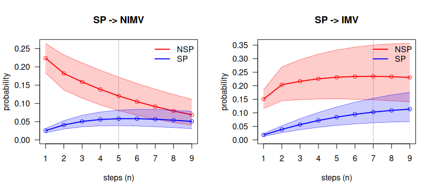
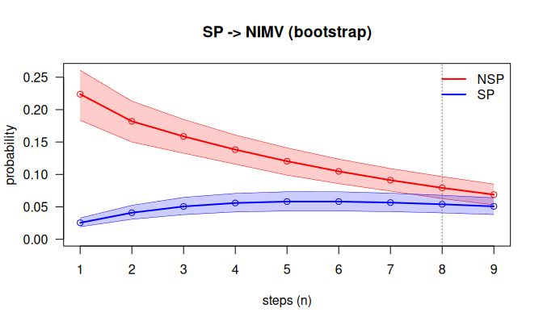

# mstate2

**Second-order Markov multistate models in R**, illustrated on the
DIVINE cohort. Install the development version from GitHub:

``` r

# install.packages("remotes")
remotes::install_github("jcarmezim/mstate2", build_vignettes = TRUE)
```

This guide shows how to analyse a multistate process with **second-order
Markov models** in `mstate2`, using the DIVINE cohort of patients
hospitalised with COVID-19, the real-data illustration of
Najera-Zuloaga, Besalú and Gómez Melis (2025). It reproduces the
analysis of the paper step by step and adds bootstrap intervals for the
predictions. Every exported function is introduced at the point of the
analysis where it is needed, with its arguments, what it computes and
how to read its output. A complete function reference is in
[`vignette("reference")`](https://jcarmezim.github.io/mstate2/articles/reference.md).

# 1. Second-order models

A classical multistate model (e.g. with `mstate`) assumes the
**first-order Markov property**: the state at the next time depends on
the past only through the state at the current time. `mstate2` adds one
step of memory: the state at the next time depends on the state at the
current time **and at the previous time**. In discrete time, the basic
quantity is the **1-step second-order transition probability**

``` math
P_{hj\ell} = P(X_s = \ell \mid X_{s-1} = j,\; X_{s-2} = h),
```

where $`h`$ is the state at the previous time, $`j`$ the state at the
current time and $`\ell`$ the state at the next time. States at earlier
times are assumed irrelevant. The pair $`(h, j)`$ is called the
**history**.

Assumptions:

1.  **Discrete time**: the process is observed on a regular grid (here,
    days).
2.  **Second order**: the next state depends on $`(X_{s-2}, X_{s-1})`$
    only.
3.  **Time homogeneity**: $`P_{hj\ell}`$ does not depend on $`s`$.
4.  **Independent patients**.

## Notation

| Symbol | Meaning | In the package |
|----|----|----|
| $`X_s`$ | state occupied at time $`s`$ | `state` column of a panel |
| $`\tilde N_{hj\ell}(s)`$ | patients with $`X_{s-2} = h`$, $`X_{s-1} = j`$, $`X_s = \ell`$ | table `N` of [`prep2()`](https://jcarmezim.github.io/mstate2/reference/prep2.md) |
| $`\tilde Y_{hj}(s-1)`$ | patients at risk: $`X_{s-2} = h`$, $`X_{s-1} = j`$ | table `Y` of [`prep2()`](https://jcarmezim.github.io/mstate2/reference/prep2.md) |
| $`P_{hj\ell}`$ | 1-step second-order transition probability | `P2est()$P[j, l, h]` |
| $`P_{hj\ell}(1, n)`$ | $`P(X_{n+1} = \ell \mid X_1 = j, X_0 = h)`$, the $`n`$-step probability | [`ckequations()`](https://jcarmezim.github.io/mstate2/reference/ckequations.md) |

**Tensor layout.** Probabilities are stored in an
$`M \times M \times M`$ array indexed **`P[j, l, h]`**: rows = state at
the current time, columns = state at the next time, slices = state at
the previous time. Each slice `P[, , h]` is an ordinary transition
matrix.

## Package map

| Stage | Function | Output (class) |
|----|----|----|
| Data | [`msprep2()`](https://jcarmezim.github.io/mstate2/reference/msprep2.md), [`sojourn_to_panel()`](https://jcarmezim.github.io/mstate2/reference/sojourn_to_panel.md), [`rnd()`](https://jcarmezim.github.io/mstate2/reference/rnd.md) | daily panel, a tibble `(id, time, state)` (`msm2prep` with its report) |
| Counting processes | [`prep2()`](https://jcarmezim.github.io/mstate2/reference/prep2.md) | `msm2data` |
| Estimation | [`P2est()`](https://jcarmezim.github.io/mstate2/reference/P2est.md), [`P2boot()`](https://jcarmezim.github.io/mstate2/reference/P2boot.md) | `P2est`, `P2boot` |
| Prediction | [`ckequations()`](https://jcarmezim.github.io/mstate2/reference/ckequations.md) | vector / matrix / tibble |
| Does the previous time matter? | [`compare2()`](https://jcarmezim.github.io/mstate2/reference/compare2.md), [`overlap_step()`](https://jcarmezim.github.io/mstate2/reference/overlap_step.md) | `msm2pred`, list |
| Simulation | [`simulate2()`](https://jcarmezim.github.io/mstate2/reference/simulate2.md) | panel |

# 2. The DIVINE cohort

DIVINE followed 2076 patients hospitalised with COVID-19. The multistate
extract is distributed by the DIVINE project
([`msm_data/MSM_Data.RData`](https://github.com/bruigtp/DIVINE/tree/main/msm_data))
and is not included in `mstate2`. It is a data frame `MSM` with one row
per patient:

| Column | Content |
|----|----|
| `id` | patient identifier |
| `inistat` | state at admission (1 = non-severe pneumonia, 2 = severe pneumonia) |
| `t.nosp`, `t.sp`, `t.nimv`, `t.mv`, `t.recov` | days spent in each state |
| `disch.s`, `death.s` | 0/1 indicators of discharge and death |

The states are non-severe pneumonia (`NSP`), severe pneumonia (`SP`),
non-invasive and invasive mechanical ventilation (`NIMV`, `IMV`),
recovery after respiratory support (`Recov`), discharge (`Disch`) and
death (`Death`).

``` r

library(mstate2)
library(dplyr)
load("MSM_Data.RData")
```

``` r

dim(MSM)
#> [1] 2076    9
count(MSM, inistat)                                   # state at admission
#>   inistat    n
#> 1       1 1855
#> 2       2  221
summarise(MSM, discharged = sum(disch.s), died = sum(death.s))
#>   discharged died
#> 1       1858  218
```

# 3. Preparing the data

All the functions of the package work on a **daily panel**: one row per
patient and day, with columns `id`, `time` and `state`. Any data in that
form can be passed to
[`prep2()`](https://jcarmezim.github.io/mstate2/reference/prep2.md).
[`msprep2()`](https://jcarmezim.github.io/mstate2/reference/msprep2.md)
builds it from raw data as they are collected (dates of each state, one
column per state, days spent in each state, or an `mstate` object) and
reports every record it has to change; for data like DIVINE, with the
days spent in each state,
[`sojourn_to_panel()`](https://jcarmezim.github.io/mstate2/reference/sojourn_to_panel.md)
builds it too.

## `sojourn_to_panel()`: from days spent in each state

``` r

sojourn_to_panel(data, id, segments, absorbing, round_fun = rnd)
```

| Argument | Meaning |
|----|----|
| `data` | one row per patient |
| `id` | name of the identifier column |
| `segments` | named vector `c(state = "duration column")`, **in visiting order** |
| `absorbing` | named vector `c(state = "0/1 indicator")`; the first one equal to 1 ends follow-up |
| `round_fun` | discretisation of the durations (default [`rnd()`](https://jcarmezim.github.io/mstate2/reference/rnd.md)) |

For each patient, every duration is rounded to whole days, each state is
repeated as many days as its duration, in the order of `segments`, and
the absorbing state whose indicator is 1 is appended. A patient with no
event is right-censored. Because only total durations are available, the
order of the visits is the one given by `segments` and each state is
visited at most once.

``` r

segs  <- c(NSP = "t.nosp", SP = "t.sp", NIMV = "t.nimv", IMV = "t.mv", Recov = "t.recov")
absb  <- c(Disch = "disch.s", Death = "death.s")
panel <- sojourn_to_panel(MSM, id = "id", segments = segs, absorbing = absb)
dim(panel)
#> [1] 27736     3
count(panel, state)
#> # A tibble: 7 × 2
#>   state     n
#>   <chr> <int>
#> 1 Death   218
#> 2 Disch  1858
#> 3 IMV    4681
#> 4 NIMV   1019
#> 5 NSP   12432
#> 6 Recov  4228
#> 7 SP     3300
```

[`count()`](https://dplyr.tidyverse.org/reference/count.html) gives the
patient-days in each state: the panel has one row per patient and day of
follow-up, ending in `Disch` or `Death`.

## `rnd()`: rounding half away from zero

``` r

rnd(c(0.5, 1.5, 2.5))
#> [1] 1 2 3
round(c(0.5, 1.5, 2.5))
#> [1] 0 2 2
```

[`round()`](https://rdrr.io/r/base/Round.html) sends halves to the
nearest even integer, so a stay of half a day would vanish.
[`rnd()`](https://jcarmezim.github.io/mstate2/reference/rnd.md) sends
them away from zero, as in the DIVINE analysis. In DIVINE, 146
severe-pneumonia stays last a whole number of days plus one half. If a
positive stay rounds to 0 days,
[`sojourn_to_panel()`](https://jcarmezim.github.io/mstate2/reference/sojourn_to_panel.md)
drops it and warns, because the transitions into and out of that state
would be lost; this never happens in DIVINE.

## `msprep2()`: from raw data as collected

``` r

msprep2(data, id = "id", format = "auto",
        time = "time", state = "state",           # events: one row per state change
        times = NULL, status = NULL,               # wide: one time column per state
        durations = NULL, outcome = NULL,          # sojourn: days spent in each state
        initial = NULL, start = NULL, end = NULL, unit = 1, round_fun = rnd,
        recode = NULL, states = NULL, absorbing = NULL, trans = NULL,
        ties = "last", check = "warn", keep = NULL)
```

[`msprep2()`](https://jcarmezim.github.io/mstate2/reference/msprep2.md)
plays the role of
[`mstate::msprep()`](https://rdrr.io/pkg/mstate/man/msprep.html), but
returns the daily panel of second-order models and accepts the data in
the layout in which they were collected:

| Layout | One row per | Arguments |
|----|----|----|
| events | subject and recorded state, with the date or time it was entered | `time`, `state` |
| wide (as `msprep()`) | subject, with one time column (and optionally one status column) per state | `times`, `status` |
| sojourn (as DIVINE) | subject, with the days spent in each state | `durations`, `outcome` |
| `msdata` | an object made by [`mstate::msprep()`](https://rdrr.io/pkg/mstate/man/msprep.html) | — |

**The easiest way: conventional names.** If the columns are called
`<state>_time` and `<state>_status` for every state (e.g. `death_time`
and `death_status`; time of entry, or of censoring when the status is
0), the initial state of each individual is in `inistat` and the
individual in `id`, nothing else needs to be said: `msprep2(data)` takes
the states from the names, in column order, and keeps every other column
as a covariate.

``` r

conv <- tibble(id = 1:4, inistat = c("healthy", "healthy", "ill", "healthy"),
               healthy_time = 0, healthy_status = c(1, 1, 0, 1),
               ill_time  = c(2, 6, 0, 3), ill_status  = c(1, 0, 1, 1),
               dead_time = c(5, 6, 4, 8), dead_status = c(1, 0, 1, 0),
               age = c(60, 72, 55, 49))
msprep2(conv, absorbing = "dead")
#> <msm2prep>  discrete-time panel ready for prep2()
#>   layout          : wide
#>   subjects        : 4 (2 absorbed, 2 censored)
#>   panel rows      : 27 (time 0 - 8)
#>   states (3)      : healthy, ill, dead
#>   absorbing       : dead
#>   transitions     : 2 types, 4 in total
#>   issues          : none
```

**Any column names: a list of states.** If the columns have other names,
`states` can be a list that gives, for each state and in order, its time
and status columns. Every other column (except `id` and the initial
state) is kept as a covariate:

``` r

own <- tibble(patient = 1:4, start_state = c("healthy", "healthy", "ill", "healthy"),
              t_ill = c(2, 6, 0, 3), ill = c(1, 0, 1, 1),
              t_dth = c(5, 6, 4, 8), dth = c(1, 0, 1, 0), age = c(60, 72, 55, 49))
msprep2(own, id = "patient", initial = "start_state", absorbing = "dead",
        states = list(healthy = NULL,                            # only initial: no columns
                      ill     = c(time = "t_ill", status = "ill"),
                      dead    = c(time = "t_dth", status = "dth")))
#> <msm2prep>  discrete-time panel ready for prep2()
#>   layout          : wide
#>   subjects        : 4 (2 absorbed, 2 censored)
#>   panel rows      : 27 (time 0 - 8)
#>   states (3)      : healthy, ill, dead
#>   absorbing       : dead
#>   transitions     : 2 types, 4 in total
#>   issues          : none
```

The shortest way is `Surv(time, status)` from **survival**, with the
column names written without quotes. It is evaluated on the data, so it
can contain expressions; the times can be numbers or dates (also text),
and the status is checked by
[`survival::Surv()`](https://rdrr.io/pkg/survival/man/Surv.html) (0/1,
`TRUE`/`FALSE`, or 1/2 with a warning):

``` r

library(survival)
msprep2(own, id = "patient", initial = "start_state", absorbing = "dead",
        states = list(healthy = NULL,
                      ill     = Surv(t_ill, ill),
                      dead    = Surv(t_dth, dth == 1)))
#> <msm2prep>  discrete-time panel ready for prep2()
#>   layout          : wide
#>   subjects        : 4 (2 absorbed, 2 censored)
#>   panel rows      : 27 (time 0 - 8)
#>   states (3)      : healthy, ill, dead
#>   absorbing       : dead
#>   transitions     : 2 types, 4 in total
#>   issues          : none
```

Each state can also be written `c("t_ill" = "ill")` (time column =
status column), `c("t_ill", "ill")` (the 0/1 column is taken as the
status) or just `"t_ill"` (no status: visited when its time is
recorded), and the forms can be mixed.

**From `mstate` in one call.** The usual `mstate` preparation of the
`ebmt3` data needs a transition matrix built with `transMat()` from
state indices, the time and status columns in two parallel vectors with
`NA` for the initial state, and the covariates listed in `keep`:

``` r

tmat  <- mstate::transMat(x = list(c(2, 3), c(3), c()), names = c("Tx", "PR", "RelDeath"))
msbmt <- mstate::msprep(time = c(NA, "prtime", "rfstime"), status = c(NA, "prstat", "rfsstat"),
                        data = ebmt3, trans = tmat, keep = c("dissub", "age", "drmatch", "tcd", "prtime"))
```

With
[`msprep2()`](https://jcarmezim.github.io/mstate2/reference/msprep2.md)
each state carries its own columns, the state without columns (`Tx`) is
the initial state, the transitions are written as they are read, and the
other columns are kept as covariates:

``` r

bmt <- msprep2(ebmt3,
               states = list(Tx       = NULL,
                             PR       = Surv(prtime, prstat),
                             RelDeath = Surv(rfstime, rfsstat)),
               trans  = c("Tx -> PR -> RelDeath", "Tx -> RelDeath"))
```

`trans` is optional (without it, the absorbing states are the states
nobody leaves) and can also be a list of destinations,
`list(Tx = c("PR", "RelDeath"), PR = "RelDeath", RelDeath = NULL)`, or
an `mstate` matrix.

Times can be numbers or dates (also text such as `"15/03/2020"`),
measured from each patient’s origin (`start`, e.g. the admission date)
in units of `unit` (`"day"`, `"week"`, …). Codes can be relabelled with
`recode`, and a matrix of allowed transitions (`trans`, as
[`mstate::transMat()`](https://rdrr.io/pkg/mstate/man/transMat.html)) is
checked. Every record that is dropped or changed (missing values,
records before the origin, after the end of follow-up or after death,
two states in the same day, transitions not allowed) is listed in
`x$issues`, with one warning.

With DIVINE, the sojourn layout gives the same panel as
[`sojourn_to_panel()`](https://jcarmezim.github.io/mstate2/reference/sojourn_to_panel.md),
plus the report:

``` r

x <- msprep2(MSM, durations = segs, outcome = absb,
             states = c("NSP", "SP", "Recov", "NIMV", "IMV", "Disch", "Death"))
x
#> <msm2prep>  discrete-time panel ready for prep2()
#>   layout          : sojourn
#>   subjects        : 2076 (2076 absorbed, 0 censored)
#>   panel rows      : 27736 (time 0 - 138)
#>   states (7)      : NSP, SP, Recov, NIMV, IMV, Disch, Death
#>   absorbing       : Disch, Death
#>   transitions     : 14 types, 3433 in total
#>   issues          : none
all.equal(x$panel |> mutate(state = as.character(state)), panel)
#> [1] TRUE
```

Raw records with dates, one row per change of state, are handled in the
same way; here two invented patients, one of them with a record after
death:

``` r

raw <- tibble(id    = c(1, 1, 1, 2, 2, 2),
              date  = c("01/03/2020", "03/03/2020", "06/03/2020",
                        "02/03/2020", "09/03/2020", "10/03/2020"),
              state = c("1", "2", "D", "2", "D", "2"))
y <- msprep2(raw, time = "date", state = "state",
             recode = c("1" = "NSP", "2" = "SP", "D" = "Death"), absorbing = "Death")
#> Warning: 1 record(s) were dropped or changed while building the panel (after_absorbing:
#> 1); see the `issues` table of the result.
y$panel
#> # A tibble: 14 × 3
#>       id  time state
#>    <dbl> <int> <fct>
#>  1     1     0 NSP  
#>  2     1     1 NSP  
#>  3     1     2 SP   
#>  4     1     3 SP   
#>  5     1     4 SP   
#>  6     1     5 Death
#>  7     2     0 SP   
#>  8     2     1 SP   
#>  9     2     2 SP   
#> 10     2     3 SP   
#> 11     2     4 SP   
#> 12     2     5 SP   
#> 13     2     6 SP   
#> 14     2     7 Death
y$issues
#> # A tibble: 1 × 5
#>      id issue           state time       detail                                 
#>   <dbl> <chr>           <chr> <chr>      <chr>                                  
#> 1     2 after_absorbing SP    2020-03-10 after the entry into an absorbing state
```

The result goes straight into
[`prep2()`](https://jcarmezim.github.io/mstate2/reference/prep2.md),
which takes the states and absorbing states from it.

## `prep2()`: the second-order counting processes

``` r

prep2(data, id = "id", time = "time", state = "state",
      states = NULL, absorbing = NULL, drop.na = FALSE, check.consecutive = TRUE)
```

| Argument | Meaning |
|----|----|
| `data` | daily panel |
| `id`, `time`, `state` | column names |
| `states` | state space **and its order** (default: observed states) |
| `absorbing` | absorbing states (default: states that are never left) |
| `drop.na` | drop rows with missing values (with a warning) instead of failing |
| `check.consecutive` | warn if a patient’s days are not consecutive |

[`prep2()`](https://jcarmezim.github.io/mstate2/reference/prep2.md)
forms, for every patient, all triples of consecutive days
$`(X_{s-2}, X_{s-1}, X_s) = (h, j, \ell)`$, and counts them:
$`\tilde N_{hj\ell}(s)`$ is the number of patients with history
$`(h, j)`$ that are in $`\ell`$ at time $`s`$, and
$`\tilde Y_{hj}(s-1) = \sum_\ell \tilde N_{hj\ell}(s)`$ the number at
risk. The first two days of each patient have no complete history and
form no triple.

``` r

estados <- c("NSP", "SP", "Recov", "NIMV", "IMV", "Disch", "Death")
d <- prep2(panel, states = estados)
d
#> <msm2data>  second-order counting processes
#>   subjects        : 2076
#>   observed triples: 23584
#>   time range      : 0 - 138
#>   states (7)      : NSP, SP, Recov, NIMV, IMV, Disch, Death
#>   absorbing       : Disch, Death
#>   distinct (h,j)  : 12
head(d$N)
#> # A tibble: 6 × 5
#>   h     j     l         s     N
#>   <fct> <fct> <fct> <int> <int>
#> 1 NSP   NSP   NSP       2  1505
#> 2 NSP   NSP   NSP       3  1306
#> 3 NSP   NSP   NSP       4  1147
#> 4 NSP   NSP   NSP       5   955
#> 5 NSP   NSP   NSP       6   788
#> 6 NSP   NSP   NSP       7   610
head(d$Y)
#> # A tibble: 6 × 4
#>   h     j         s     Y
#>   <fct> <fct> <int> <int>
#> 1 NSP   NSP       2  1658
#> 2 NSP   NSP       3  1505
#> 3 NSP   NSP       4  1306
#> 4 NSP   NSP       5  1147
#> 5 NSP   NSP       6   955
#> 6 NSP   NSP       7   788
```

Besides `N` and `Y`, the object contains `triples`, one row per patient
and day at risk (`id, h, j, l, s`), which
[`P2boot()`](https://jcarmezim.github.io/mstate2/reference/P2boot.md)
uses to resample patients.

**Why.** The likelihood of a second-order Markov chain depends on the
data only through these counts (Anderson and Goodman, 1957): they are
computed once and every other function reuses them.

[`summary()`](https://rdrr.io/r/base/summary.html) reports the exposure
of each history $`(h, j)`$: the number of patient-days at risk (the
denominator of the estimator) and the range of times:

``` r

expo <- summary(d)
#> <msm2data summary>
#>   2076 subjects, 23584 triples, time 0-138
#>   exposure per (h, j) pair:
#> # A tibble: 12 × 5
#>    h     j     total_at_risk s_min s_max
#>    <fct> <fct>         <int> <int> <int>
#>  1 NSP   NSP           10577     2    43
#>  2 NSP   SP              411     2    37
#>  3 SP    SP             2668     2    50
#>  4 SP    Recov           223     3    51
#>  5 SP    NIMV            214     2    37
#>  6 SP    IMV             166     2    38
#>  7 Recov Recov          3764     4   138
#>  8 NIMV  Recov           101     3    36
#>  9 NIMV  NIMV            805     3    41
#> 10 NIMV  IMV             102     3    21
#> 11 IMV   Recov           140     4    97
#> 12 IMV   IMV            4413     3    96
```

Histories such as $`(\mathrm{NSP}, \mathrm{NSP})`$ accumulate more than
10000 patient-days, while $`(\mathrm{NIMV}, \mathrm{Recov})`$ has 101:
the second will have much wider confidence intervals.

# 4. Estimation

## `P2est()`: the relative probability estimator

``` r

P2est(object, conf.level = 0.95, ci = c("wald", "logit"), clip = TRUE)
```

| Argument | Meaning |
|----|----|
| `object` | an `msm2data` object |
| `conf.level` | confidence level |
| `ci` | `"wald"` (symmetric) or `"logit"` (delta method on the log-odds scale) |
| `clip` | truncate Wald intervals to $`[0, 1]`$ |

Each probability is estimated with the **relative probability
estimator** (RPE), which pools all transitions and all patient-days at
risk of the history:

``` math
\tilde P_{hj\ell} = \frac{\sum_s \tilde N_{hj\ell}(s)}{\sum_s \tilde Y_{hj}(s-1)},
\qquad
\mathrm{se} = \sqrt{\frac{\tilde P_{hj\ell}(1-\tilde P_{hj\ell})}{\sum_s \tilde Y_{hj}(s-1)}}.
```

These are Eq. 9 and the variance of Theorem 5 of the paper; the Wald
interval $`\tilde P_{hj\ell} \pm z\,\mathrm{se}`$ is that of its
Corollary 2. On DIVINE, the estimates coincide with those of the paper’s
code.

For every absorbing state $`a`$, `P[a, a, h]` is set to 1 for every
$`h`$, so that no probability is lost when predictions are propagated.

``` r

fit <- P2est(d)
fit
#> <P2est>  RPE estimates of 1-step second-order transition probabilities
#>   states: NSP, SP, Recov, NIMV, IMV, Disch, Death
#>   95% wald confidence intervals; 2076 subjects
#>   39 estimated transition probabilities (h -> j -> l)
```

The `estimate` table has one row per observed $`(h, j, \ell)`$, with the
estimate, standard error, interval, number of transitions (`n.trans`)
and patient-days at risk (`at.risk`). **Table 2 of the paper** is the
part for patients in severe pneumonia at the current time:

``` r

fit$estimate |>
  filter(j == "SP")
#> # A tibble: 10 × 9
#>    h     j     l           p      se   lower   upper n.trans at.risk
#>    <fct> <fct> <fct>   <dbl>   <dbl>   <dbl>   <dbl>   <int>   <int>
#>  1 NSP   SP    SP    0.616   0.0240  0.569   0.663       253     411
#>  2 NSP   SP    Recov 0.00730 0.00420 0       0.0155        3     411
#>  3 NSP   SP    NIMV  0.224   0.0206  0.184   0.264        92     411
#>  4 NSP   SP    IMV   0.151   0.0177  0.116   0.185        62     411
#>  5 NSP   SP    Death 0.00243 0.00243 0       0.00720       1     411
#>  6 SP    SP    SP    0.865   0.00662 0.852   0.878      2307    2668
#>  7 SP    SP    Recov 0.0825  0.00533 0.0720  0.0929      220    2668
#>  8 SP    SP    NIMV  0.0255  0.00305 0.0195  0.0315       68    2668
#>  9 SP    SP    IMV   0.0184  0.00260 0.0133  0.0235       49    2668
#> 10 SP    SP    Death 0.00900 0.00183 0.00541 0.0126       24    2668
```

A patient in `SP` who was in `NSP` at the previous time (who has just
worsened) has a probability of 0.224 of non-invasive ventilation the
next day; one who was already in `SP` at the previous time, of 0.025. A
first-order model would give them the same probability.

The tensor holds the same estimates; `P["SP", , ]` shows, for each state
at the previous time (columns), the distribution of the next state
(rows):

``` r

round(fit$P["SP", , c("NSP", "SP")], 3)
#>         NSP    SP
#> NSP   0.000 0.000
#> SP    0.616 0.865
#> Recov 0.007 0.082
#> NIMV  0.224 0.025
#> IMV   0.151 0.018
#> Disch 0.000 0.000
#> Death 0.002 0.009
```

**Logit intervals** stay inside $`(0, 1)`$ and are preferable for small
probabilities:

``` r

fit_lg <- P2est(d, ci = "logit")
fit_lg$estimate |>
  filter(j == "SP", l == "Death") |>
  select(h, l, p, lower, upper)
#> # A tibble: 2 × 5
#>   h     l           p    lower  upper
#>   <fct> <fct>   <dbl>    <dbl>  <dbl>
#> 1 NSP   Death 0.00243 0.000343 0.0171
#> 2 SP    Death 0.00900 0.00604  0.0134
```

## `P2boot()`: bootstrap of patients

``` r

P2boot(object, B = 200, conf.level = 0.95, seed = NULL)
```

A patient contributes many days to the same history, and the $`n`$-step
predictions of Section 5 need intervals that account for the uncertainty
of all the estimates at once.
[`P2boot()`](https://jcarmezim.github.io/mstate2/reference/P2boot.md)
resamples **whole patients** with replacement and re-estimates every
probability in each of the `B` replicates. The result is a `P2est`
object with the replicates attached and an extra column `se.boot`; every
function that takes a `P2est` also takes a `P2boot` and then uses
**percentile bootstrap intervals**. The per-patient counts are computed
once, so replicates are cheap:

``` r

system.time(bt <- P2boot(d, B = 500, seed = 1))
#>    user  system elapsed 
#>   0.333   0.012   0.345
bt$estimate |>
  filter(j == "SP") |>
  select(h, l, p, se, se.boot)
#> # A tibble: 10 × 5
#>    h     l           p      se se.boot
#>    <fct> <fct>   <dbl>   <dbl>   <dbl>
#>  1 NSP   SP    0.616   0.0240  0.0244 
#>  2 NSP   Recov 0.00730 0.00420 0.00419
#>  3 NSP   NIMV  0.224   0.0206  0.0198 
#>  4 NSP   IMV   0.151   0.0177  0.0180 
#>  5 NSP   Death 0.00243 0.00243 0.00238
#>  6 SP    SP    0.865   0.00662 0.00736
#>  7 SP    Recov 0.0825  0.00533 0.00430
#>  8 SP    NIMV  0.0255  0.00305 0.00347
#>  9 SP    IMV   0.0184  0.00260 0.00275
#> 10 SP    Death 0.00900 0.00183 0.00199
```

**Why.** Patients are the independent units and their days are not, so
whole patients are resampled, the standard bootstrap for clustered data
(Davison and Hinkley, 1997; Field and Welsh, 2007). The $`n`$-step
predictions are non-linear functions of all the estimates; propagating
every replicate and taking percentiles (Efron and Tibshirani, 1993)
avoids a cumbersome delta-method variance.

# 5. Prediction

## `ckequations()`: the extended Chapman–Kolmogorov relation

``` r

ckequations(x, h, j, l = NULL, nsteps = 9, bounds = FALSE)
```

| Argument | Meaning |
|----|----|
| `x` | a `P2est` or `P2boot` object, or any $`M \times M \times M`$ tensor |
| `h`, `j` | state at time 0 (the previous time) and at time 1 (the current time) |
| `l` | target state(s); `NULL` = the whole distribution |
| `nsteps` | horizon $`n`$ |
| `bounds` | add intervals: evolution intervals for a `P2est`, percentile intervals for a `P2boot` |

It computes
$`P_{hj\ell}(1, n) = P(X_{n+1} = \ell \mid X_1 = j, X_0 = h)`$. The
second-order chain is rewritten as a first-order chain on **pairs**
$`Z_s = (X_{s-1}, X_s)`$, with transition matrix
$`Q_{(a,b) \to (b,c)} = P_{abc}`$; the distribution of the pair is
multiplied by $`Q`$ once per step, which is exact and linear in $`n`$.

Distribution of the state over the next 9 days for a patient in `SP` who
was in `NSP` at the previous time:

``` r

round(ckequations(fit, h = "NSP", j = "SP", nsteps = 9), 3)
#>       NSP    SP Recov  NIMV   IMV Disch Death
#>  [1,]   0 0.616 0.007 0.224 0.151 0.000 0.002
#>  [2,]   0 0.532 0.067 0.182 0.204 0.001 0.015
#>  [3,]   0 0.460 0.132 0.159 0.217 0.005 0.028
#>  [4,]   0 0.398 0.183 0.138 0.226 0.015 0.040
#>  [5,]   0 0.344 0.220 0.120 0.231 0.032 0.052
#>  [6,]   0 0.298 0.247 0.105 0.234 0.054 0.063
#>  [7,]   0 0.257 0.264 0.091 0.235 0.079 0.074
#>  [8,]   0 0.222 0.275 0.079 0.234 0.106 0.084
#>  [9,]   0 0.192 0.279 0.069 0.231 0.135 0.094
```

Each row sums to 1. With one target and `bounds = TRUE`, the paper’s
**evolution intervals** propagate the lower and upper confidence
tensors:

``` r

ckequations(fit, h = "NSP", j = "SP", l = "NIMV", nsteps = 9, bounds = TRUE)
#> # A tibble: 9 × 4
#>       n estimate  lower upper
#>   <int>    <dbl>  <dbl> <dbl>
#> 1     1   0.224  0.184  0.264
#> 2     2   0.182  0.137  0.233
#> 3     3   0.159  0.114  0.211
#> 4     4   0.138  0.0958 0.190
#> 5     5   0.120  0.0804 0.172
#> 6     6   0.105  0.0675 0.154
#> 7     7   0.0912 0.0568 0.139
#> 8     8   0.0793 0.0478 0.124
#> 9     9   0.0689 0.0403 0.111
```

These intervals are conservative: they assume that all the probabilities
are simultaneously at their lower (or upper) limit, so they widen
quickly with $`n`$. With a `P2boot` object the intervals are bootstrap
percentiles:

``` r

ckequations(bt, h = "NSP", j = "SP", l = "NIMV", nsteps = 9, bounds = TRUE)
#> # A tibble: 9 × 4
#>       n estimate  lower  upper
#>   <int>    <dbl>  <dbl>  <dbl>
#> 1     1   0.224  0.183  0.261 
#> 2     2   0.182  0.150  0.213 
#> 3     3   0.159  0.133  0.185 
#> 4     4   0.138  0.116  0.161 
#> 5     5   0.120  0.0989 0.141 
#> 6     6   0.105  0.0858 0.124 
#> 7     7   0.0912 0.0743 0.109 
#> 8     8   0.0793 0.0626 0.0968
#> 9     9   0.0689 0.0530 0.0850
```

# 6. Does the previous time matter?

## `compare2()` and `overlap_step()`: for how long?

``` r

compare2(object, h, j, l, nsteps = 9, bounds = TRUE)
overlap_step(x)
```

[`compare2()`](https://jcarmezim.github.io/mstate2/reference/compare2.md)
computes the $`n`$-step curves $`P_{hj\ell}(1, n)`$ for several states
at the previous time `h`, with a common current state `j` and target
`l`, and returns an `msm2pred` object with
[`print()`](https://rdrr.io/r/base/print.html),
[`summary()`](https://rdrr.io/r/base/summary.html) and
[`plot()`](https://rdrr.io/r/graphics/plot.default.html) methods.
[`overlap_step()`](https://jcarmezim.github.io/mstate2/reference/overlap_step.md)
finds, for two curves, the **first step at which their intervals
overlap**: from then on, the state at the previous time no longer
changes the prediction significantly. It returns the step `n`, the time
`s = n + 1`, the number of leading steps with separated intervals and
the separation $`\max(L_1, L_2) - \min(U_1, U_2)`$ at each step.

With evolution intervals, as in **Section 6.3 of the paper**:

``` r

cmp_nimv <- compare2(fit, h = c("NSP", "SP"), j = "SP", l = "NIMV")
cmp_imv  <- compare2(fit, h = c("NSP", "SP"), j = "SP", l = "IMV")
summary(cmp_nimv)
#> Trajectory comparison (RPE, 95% evolution intervals)
#>   target 'NIMV' via current state 'SP'; preceding: NSP, SP
#>   intervals first overlap at step 5 (time s = 6); significant for the first 4 step(s).
summary(cmp_imv)
#> Trajectory comparison (RPE, 95% evolution intervals)
#>   target 'IMV' via current state 'SP'; preceding: NSP, SP
#>   intervals first overlap at step 7 (time s = 8); significant for the first 6 step(s).
```

``` r

op <- par(mfrow = c(1, 2))
plot(cmp_nimv, dualaxis = FALSE, xlab = "steps (n)", main = "SP -> NIMV")
plot(cmp_imv,  dualaxis = FALSE, xlab = "steps (n)", main = "SP -> IMV")
```



plot of chunk compare2-plot

``` r

par(op)
```

The dotted line marks the first overlap: 5 days for `NIMV` and 7 for
`IMV`, as in the paper. With a `P2boot` fit the same comparison uses
bootstrap intervals, which are narrower than the evolution intervals:

``` r

cmp_b <- compare2(bt, h = c("NSP", "SP"), j = "SP", l = "NIMV")
summary(cmp_b)
#> Trajectory comparison (RPE, 95% bootstrap intervals)
#>   target 'NIMV' via current state 'SP'; preceding: NSP, SP
#>   intervals first overlap at step 8 (time s = 9); significant for the first 7 step(s).
plot(cmp_b, dualaxis = FALSE, xlab = "steps (n)", main = "SP -> NIMV (bootstrap)")
```



plot of chunk compare2-boot

# 7. Simulation: `simulate2()`

``` r

simulate2(n, tensor, first, init = NULL, entry = NULL, states = NULL, maxT = 1000)
```

[`simulate2()`](https://jcarmezim.github.io/mstate2/reference/simulate2.md)
generates a daily panel from a second-order model given by a tensor
`P[j, l, h]`, a matrix `first` for the first move (which has no previous
time) and the distribution `init` of the state at time 0; with `entry`,
patients enter at different global times (Section 5 of the paper). It is
useful to study the methods under a known model;
[`vignette("paper")`](https://jcarmezim.github.io/mstate2/articles/paper.md)
uses it to reproduce the simulation study of the paper (Table 1). For
instance, from the model fitted to DIVINE:

``` r

first_moves <- inner_join(
  panel |> filter(time == 0) |> select(id, from = state),     # state at admission
  panel |> filter(time == 1) |> select(id, to = state),       # state on day 1
  by = "id")
first_mat <- first_moves |>                                    # first move (no previous time)
  count(from = factor(from, estados), to = factor(to, estados), .drop = FALSE) |>
  group_by(from) |>
  mutate(p = n / pmax(sum(n), 1)) |>
  ungroup() |>
  xtabs(formula = p ~ from + to) |>
  unclass()
init <- first_moves |>                                         # distribution at admission
  count(state = factor(from, estados), .drop = FALSE) |>
  mutate(p = n / sum(n)) |>
  pull(p, name = state)
set.seed(1)
sim <- simulate2(2000, fit$P, first = first_mat, init = init)
fit_sim <- P2est(prep2(sim, states = estados))
round(c(DIVINE = fit$P["SP", "NIMV", "NSP"], simulated = fit_sim$P["SP", "NIMV", "NSP"]), 3)
#>    DIVINE simulated 
#>     0.224     0.232
```

# 8. Methodological choices

| Choice | Why | Reference |
|----|----|----|
| Discrete time, second order | memory of one previous time with a manageable number of parameters | Besalú and Gómez Melis (2024) |
| Counting processes computed once | they are sufficient statistics of the model | Anderson and Goodman (1957) |
| Relative probability estimator only | more efficient than the conditional probability estimator | Najera-Zuloaga et al. (2025) |
| Logit intervals as an option | Wald intervals behave poorly near 0 or 1 | Brown, Cai and DasGupta (2001) |
| Prediction through the chain on pairs | exact, linear in the horizon | Benson, Gleich and Lim (2017) |
| First overlap of the intervals | the criterion of Section 6.3 of the paper | Najera-Zuloaga et al. (2025) |
| Bootstrap of whole patients | patients are the independent units | Davison and Hinkley (1997); Field and Welsh (2007) |
| Percentile intervals for $`n`$-step predictions | non-linear functions of all the estimates; near-nominal coverage in simulation | Efron and Tibshirani (1993) |
| Tables handled with the tidyverse and returned as tibbles; tensors as arrays | readable data handling; the predictions are linear algebra | Wickham et al. (2019) |

# 9. Summary

| Question | Function |
|----|----|
| How do I build the daily panel from my raw data? | [`msprep2()`](https://jcarmezim.github.io/mstate2/reference/msprep2.md), [`sojourn_to_panel()`](https://jcarmezim.github.io/mstate2/reference/sojourn_to_panel.md), [`rnd()`](https://jcarmezim.github.io/mstate2/reference/rnd.md) |
| What are the counts? | [`prep2()`](https://jcarmezim.github.io/mstate2/reference/prep2.md), [`summary()`](https://rdrr.io/r/base/summary.html) |
| What is $`P_{hj\ell}`$? | [`P2est()`](https://jcarmezim.github.io/mstate2/reference/P2est.md), [`P2boot()`](https://jcarmezim.github.io/mstate2/reference/P2boot.md) |
| Where will a patient be in $`n`$ days? | [`ckequations()`](https://jcarmezim.github.io/mstate2/reference/ckequations.md) |
| Does the state at the previous time matter, and for how long? | [`compare2()`](https://jcarmezim.github.io/mstate2/reference/compare2.md), [`overlap_step()`](https://jcarmezim.github.io/mstate2/reference/overlap_step.md) |
| How do the methods behave under a known model? | [`simulate2()`](https://jcarmezim.github.io/mstate2/reference/simulate2.md) |

# References

Anderson, T. W. and Goodman, L. A. (1957). Statistical inference about
Markov chains. *The Annals of Mathematical Statistics*, 28(1), 89–110.

Benson, A. R., Gleich, D. F. and Lim, L.-H. (2017). The spacey random
walk: a stochastic process for higher-order data. *SIAM Review*, 59(2),
321–345.

Besalú, M. and Gómez Melis, G. (2024). Second order Markov multistate
models. *SORT*, 48(2), 209–234.

Brown, L. D., Cai, T. T. and DasGupta, A. (2001). Interval estimation
for a binomial proportion. *Statistical Science*, 16(2), 101–133.

Davison, A. C. and Hinkley, D. V. (1997). *Bootstrap Methods and their
Application*. Cambridge University Press.

Efron, B. and Tibshirani, R. J. (1993). *An Introduction to the
Bootstrap*. Chapman and Hall.

Field, C. A. and Welsh, A. H. (2007). Bootstrapping clustered data.
*Journal of the Royal Statistical Society: Series B*, 69(3), 369–390.

Najera-Zuloaga, J., Besalú, M. and Gómez Melis, G. (2025). Second-order
Markov multistate models: nonparametric estimation and inference.
Manuscript submitted for publication.

Wickham, H. et al. (2019). Welcome to the tidyverse. *Journal of Open
Source Software*, 4(43), 1686.
