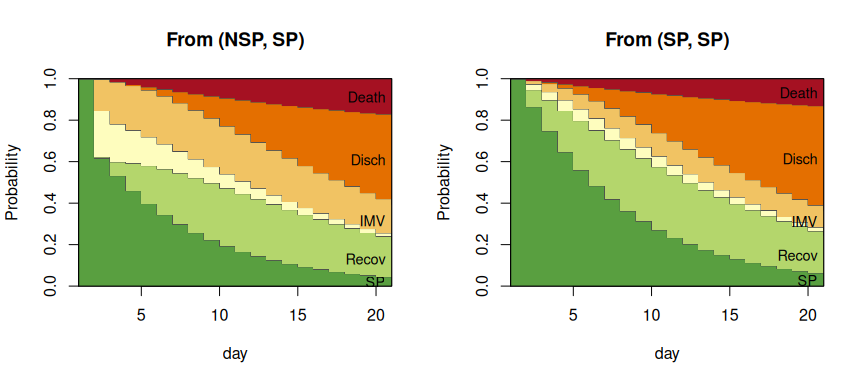
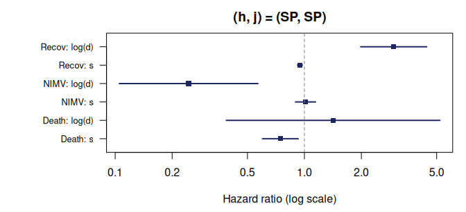
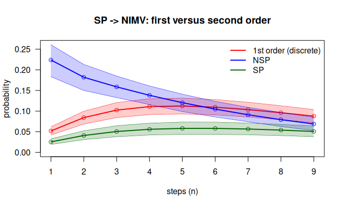

<!-- This vignette is precomputed: edit mstate2.Rmd.orig and run
     vignettes/precompile.R with the DIVINE data available. -->


This vignette shows how to analyse a multistate process with **second-order
Markov models** in `mstate2`, using the DIVINE cohort of patients hospitalised
with COVID-19, the real-data illustration of Najera-Zuloaga, Besalú and Gómez
Melis (2025). Every exported function is introduced at the point of the
analysis where it is needed, with its arguments, what it computes and how to
read its output. A complete function reference is in `vignette("reference")`.

# 1. Second-order models

A classical multistate model (e.g. with `mstate`) assumes the **first-order
Markov property**: the state at the next time depends on the past only through
the state at the current time. `mstate2` adds one step of memory: the state at
the next time depends on the state at the current time **and at the previous
time**. In discrete time, the basic quantity is the **1-step second-order
transition probability**

$$
P_{hj\ell} = P(X_s = \ell \mid X_{s-1} = j,\; X_{s-2} = h),
$$

where $h$ is the state at the previous time, $j$ the state at the current time
and $\ell$ the state at the next time. States at earlier times are assumed
irrelevant. The pair $(h, j)$ is called the **history**.

Assumptions:

1. **Discrete time**: the process is observed on a regular grid (here, days).
2. **Second order**: the next state depends on $(X_{s-2}, X_{s-1})$ only.
3. **Time homogeneity**: $P_{hj\ell}$ does not depend on $s$ (Section 7 shows
   how to relax this with covariates for time and duration).
4. **Independent patients**.

## Notation

| Symbol | Meaning | In the package |
|---|---|---|
| $X_s$ | state occupied at time $s$ | `state` column of a panel |
| $\tilde N_{hj\ell}(s)$ | patients with $X_{s-2} = h$, $X_{s-1} = j$, $X_s = \ell$ | table `N` of `prep2()` |
| $\tilde Y_{hj}(s-1)$ | patients at risk: $X_{s-2} = h$, $X_{s-1} = j$ | table `Y` of `prep2()` |
| $P_{hj\ell}$ | 1-step second-order transition probability | `P2est()$P[j, l, h]` |
| $P_{hj\ell}(1, n)$ | $P(X_{n+1} = \ell \mid X_1 = j, X_0 = h)$, the $n$-step probability | `ckequations()` |

**Tensor layout.** Probabilities are stored in an $M \times M \times M$ array
indexed **`P[j, l, h]`**: rows = state at the current time, columns = state at
the next time, slices = state at the previous time. Each slice `P[, , h]` is an
ordinary transition matrix.

## Package map

| Stage | Function | Output (class) |
|---|---|---|
| Data | `sojourn_to_panel()`, `msprep2()`, `from_msdata()`, `rnd()` | daily panel `(id, time, state)` |
| Counting processes | `prep2()` | `msm2data` |
| Estimation | `P2est()`, `P2boot()` | `P2est`, `P2boot` |
| Prediction | `ckequations()`, `probtrans2()` | vector / matrix, `probtrans2` |
| Does the previous time matter? | `compare2()`, `overlap_step()`, `markov_test()` | `msm2pred`, list, `markov_test` |
| First versus second order | `P1est()`, `compare_order()`, `divergence()`, `divergence_table()`, `as_tmat()` | `P1est`, `msm2pred`, data frames, `transMat` |
| Covariates | `P2reg()`, `P2reg_all()` | `P2reg`, `P2reg_all` |
| Simulation | `simulate2()` | panel |

# 2. The DIVINE cohort

DIVINE followed 2076 patients hospitalised with COVID-19. The multistate
extract is distributed by the DIVINE project
([`msm_data/MSM_Data.RData`](https://github.com/bruigtp/DIVINE/tree/main/msm_data))
and is not included in `mstate2`. It is a data frame `MSM` with one row per
patient:

| Column | Content |
|---|---|
| `id` | patient identifier |
| `inistat` | state at admission (1 = non-severe pneumonia, 2 = severe pneumonia) |
| `t.nosp`, `t.sp`, `t.nimv`, `t.mv`, `t.recov` | days spent in each state |
| `disch.s`, `death.s` | 0/1 indicators of discharge and death |

The states are non-severe pneumonia (`NSP`), severe pneumonia (`SP`),
non-invasive and invasive mechanical ventilation (`NIMV`, `IMV`), recovery after
respiratory support (`Recov`), discharge (`Disch`) and death (`Death`).


```r
library(mstate2)
load("MSM_Data.RData")
```


```r
dim(MSM)
#> [1] 2076    9
table(admission = MSM$inistat)
#> admission
#>    1    2 
#> 1855  221
c(discharged = sum(MSM$disch.s), died = sum(MSM$death.s))
#> discharged       died 
#>       1858        218
```

# 3. Preparing the data

All the functions of the package work on a **daily panel**: one row per
patient and day, with columns `id`, `time` and `state`. Three functions build
it from the most common formats.

## `sojourn_to_panel()`: from days spent in each state

```r
sojourn_to_panel(data, id, segments, absorbing, round_fun = rnd)
```

| Argument | Meaning |
|---|---|
| `data` | one row per patient |
| `id` | name of the identifier column |
| `segments` | named vector `c(state = "duration column")`, **in visiting order** |
| `absorbing` | named vector `c(state = "0/1 indicator")`; the first one equal to 1 ends follow-up |
| `round_fun` | discretisation of the durations (default `rnd()`) |

For each patient, every duration is rounded to whole days, each state is
repeated as many days as its duration, in the order of `segments`, and the
absorbing state whose indicator is 1 is appended. A patient with no event is
right-censored. Because only total durations are available, the order of the
visits is the one given by `segments` and each state is visited at most once.


```r
segs  <- c(NSP = "t.nosp", SP = "t.sp", NIMV = "t.nimv", IMV = "t.mv", Recov = "t.recov")
absb  <- c(Disch = "disch.s", Death = "death.s")
panel <- sojourn_to_panel(MSM, id = "id", segments = segs, absorbing = absb)
dim(panel)
#> [1] 27736     3
table(panel$state)
#> 
#> Death Disch   IMV  NIMV   NSP Recov    SP 
#>   218  1858  4681  1019 12432  4228  3300
```

`table()` counts patient-days in each state: the panel has one row per patient
and day of follow-up, ending in `Disch` or `Death`.

## `rnd()`: rounding half away from zero


```r
rnd(c(0.5, 1.5, 2.5))
#> [1] 1 2 3
round(c(0.5, 1.5, 2.5))
#> [1] 0 2 2
```

`round()` sends halves to the nearest even integer, so a stay of half a day
would vanish. `rnd()` sends them away from zero, as in the DIVINE analysis.
`sum(MSM$t.sp != round(MSM$t.sp))` = 146
severe-pneumonia stays in DIVINE are not whole days.

## `msprep2()`: from `mstate`'s wide format

```r
msprep2(time, status, data, states = NULL, trans = NULL, start = NULL,
        id = NULL, keep = NULL, absorbing = NULL, round_fun = rnd)
```

Data prepared for `mstate::msprep()` have one row per patient and, for each
state, the time of entry and a 0/1 status. `msprep2()` takes **the same
arguments** and returns the daily panel. The absorbing states are those with no
outgoing transition in `trans`, and follow-up stops when one is entered.

We rebuild the wide format from the DIVINE durations (entry time = days spent
in the states visited before) and check that `msprep2()` gives the same panel:


```r
estados <- c("NSP", "SP", "Recov", "NIMV", "IMV", "Disch", "Death")
D     <- sapply(segs, function(cl) rnd(MSM[[cl]]))      # whole days in each state
entry <- t(apply(D, 1, function(x) cumsum(c(0, x))[seq_along(x)]))
colnames(entry) <- names(segs)
end   <- rowSums(D)
first <- names(segs)[apply(D > 0, 1, function(v) which(v)[1])]   # state at admission

wide <- data.frame(id = MSM$id)
for (k in names(segs)) {
  wide[[paste0(k, ".t")]] <- ifelse(D[, k] > 0, entry[, k], end)
  wide[[paste0(k, ".s")]] <- as.integer(D[, k] > 0 & first != k)
}
wide$Disch.t <- end; wide$Disch.s <- MSM$disch.s
wide$Death.t <- end; wide$Death.s <- MSM$death.s

tmat <- as_tmat(prep2(panel, states = estados))           # transition matrix (Section 8)
panel_w <- msprep2(time = paste0(estados, ".t"), status = paste0(estados, ".s"),
                   data = wide, trans = tmat, start = list(state = first, time = 0), id = "id")
all.equal(as.data.frame(panel), as.data.frame(panel_w))
#> [1] TRUE
```

## `from_msdata()`: from an `msdata` object

```r
from_msdata(x, id = "id", from = "from", to = "to", Tstart = "Tstart",
            Tstop = "Tstop", status = "status", keep = NULL, round_fun = rnd)
```

Data already in `mstate`'s long format (one row per possible transition, as
returned by `msprep()`) are converted with `from_msdata()`: the realised
transitions give the sequence of states and their entry times, and each day
gets the state most recently entered. `prep2()` also accepts an `msdata`
object directly.


```r
ms <- mstate::msprep(time = paste0(estados, ".t"), status = paste0(estados, ".s"),
                     data = wide, trans = tmat, id = "id",
                     start = list(state = match(first, estados), time = rep(0, nrow(wide))))
panel_m <- from_msdata(ms)
panel_m[, `:=`(id = as.numeric(as.character(id)), state = estados[state])]
all.equal(as.data.frame(panel), as.data.frame(panel_m))
#> [1] TRUE
```

## `prep2()`: the second-order counting processes

```r
prep2(data, id = "id", time = "time", state = "state", covariates = NULL,
      states = NULL, absorbing = NULL, drop.na = FALSE, check.consecutive = TRUE)
```

| Argument | Meaning |
|---|---|
| `data` | daily panel, or an `msdata` object |
| `id`, `time`, `state` | column names |
| `covariates` | baseline covariates to carry along (for `P2reg()`) |
| `states` | state space **and its order** (default: observed states) |
| `absorbing` | absorbing states (default: states that are never left) |
| `drop.na` | drop rows with missing values (with a warning) instead of failing |
| `check.consecutive` | warn if a patient's days are not consecutive |

`prep2()` forms, for every patient, all triples of consecutive days
$(X_{s-2}, X_{s-1}, X_s) = (h, j, \ell)$, and counts them: $\tilde N_{hj\ell}(s)$
is the number of patients with history $(h, j)$ that are in $\ell$ at time $s$,
and $\tilde Y_{hj}(s-1) = \sum_\ell \tilde N_{hj\ell}(s)$ the number at risk.
The first two days of each patient have no complete history and form no triple.


```r
d <- prep2(panel, states = estados)
d
#> <msm2data>  second-order counting processes
#>   subjects        : 2076
#>   observed triples: 23584
#>   time range      : 0 - 138
#>   states (7)      : NSP, SP, Recov, NIMV, IMV, Disch, Death
#>   absorbing       : Disch, Death
#>   distinct (h,j)  : 12
#>   covariates      : none
head(d$N)
#>      h   j   l s    N
#> 1: NSP NSP NSP 2 1505
#> 2: NSP NSP NSP 3 1306
#> 3: NSP NSP NSP 4 1147
#> 4: NSP NSP NSP 5  955
#> 5: NSP NSP NSP 6  788
#> 6: NSP NSP NSP 7  610
head(d$Y)
#>      h   j s    Y
#> 1: NSP NSP 2 1658
#> 2: NSP NSP 3 1505
#> 3: NSP NSP 4 1306
#> 4: NSP NSP 5 1147
#> 5: NSP NSP 6  955
#> 6: NSP NSP 7  788
```

Besides `N` and `Y`, the object contains `triples` (one row per patient and
day at risk, with the history, the destination, the time `s`, the days `d`
already spent in the current state and the covariates; it is the data of
`P2reg()`) and `pairs` (every observed one-step move, including each
patient's first move, used by `as_tmat()`):


```r
names(d$triples)
#> [1] "id" "h"  "j"  "l"  "s"  "d"
d$pairs
#>      from    to     N
#>  1:   NSP   NSP 10577
#>  2:   NSP    SP   411
#>  3:   NSP Disch  1406
#>  4:   NSP Death    38
#>  5:    SP    SP  2668
#>  6:    SP Recov   223
#>  7:    SP  NIMV   214
#>  8:    SP   IMV   166
#>  9:    SP Death    29
#> 10: Recov Recov  3764
#> 11: Recov Disch   452
#> 12: Recov Death    12
#> 13:  NIMV Recov   101
#> 14:  NIMV  NIMV   805
#> 15:  NIMV   IMV   102
#> 16:  NIMV Death    11
#> 17:   IMV Recov   140
#> 18:   IMV   IMV  4413
#> 19:   IMV Death   128
```

`summary()` reports the exposure of each history $(h, j)$: the number of
patient-days at risk (the denominator of the estimator) and the range of
times:


```r
expo <- summary(d)
#> <msm2data summary>
#>   2076 subjects, 23584 triples, time 0-138
#>   exposure per (h, j) pair:
#>         h     j total_at_risk s_min s_max
#>  1:   NSP   NSP         10577     2    43
#>  2:   NSP    SP           411     2    37
#>  3:    SP    SP          2668     2    50
#>  4:    SP Recov           223     3    51
#>  5:    SP  NIMV           214     2    37
#>  6:    SP   IMV           166     2    38
#>  7: Recov Recov          3764     4   138
#>  8:  NIMV Recov           101     3    36
#>  9:  NIMV  NIMV           805     3    41
#> 10:  NIMV   IMV           102     3    21
#> 11:   IMV Recov           140     4    97
#> 12:   IMV   IMV          4413     3    96
```

Histories such as $(\mathrm{NSP}, \mathrm{NSP})$ accumulate more than 10000
patient-days, while $(\mathrm{NIMV}, \mathrm{Recov})$ has
101: the second will have much
wider confidence intervals.

# 4. Estimation

## `P2est()`: the relative probability estimator

```r
P2est(object, conf.level = 0.95, ci = c("wald", "logit"), clip = TRUE)
```

| Argument | Meaning |
|---|---|
| `object` | an `msm2data` object |
| `conf.level` | confidence level |
| `ci` | `"wald"` (symmetric) or `"logit"` (delta method on the log-odds scale) |
| `clip` | truncate Wald intervals to $[0, 1]$ |

Each probability is estimated with the **relative probability estimator**
(RPE), which pools all transitions and all patient-days at risk of the
history:

$$
\hat P_{hj\ell} = \frac{\sum_s \tilde N_{hj\ell}(s)}{\sum_s \tilde Y_{hj}(s-1)},
\qquad
\mathrm{se} = \sqrt{\frac{\hat p(1-\hat p)}{\sum_s \tilde Y_{hj}(s-1)}}.
$$

For every absorbing state $a$, `P[a, a, h]` is set to 1 for every $h$, so that
no probability is lost when predictions are propagated.


```r
fit <- P2est(d)
fit
#> <P2est>  RPE estimates of 1-step second-order transition probabilities
#>   states: NSP, SP, Recov, NIMV, IMV, Disch, Death
#>   95% wald confidence intervals; 2076 subjects
#>   39 estimated transition probabilities (h -> j -> l)
```

The `estimate` table has one row per observed $(h, j, \ell)$, with the
estimate, standard error, interval, number of transitions (`n.trans`) and
patient-days at risk (`at.risk`). **Table 2 of the paper** is the part for
patients in severe pneumonia at the current time:


```r
subset(fit$estimate, j == "SP")
#>      h  j     l        p       se    lower    upper n.trans at.risk
#> 5  NSP SP    SP 0.615572 0.023995 0.568542 0.662602     253     411
#> 6  NSP SP Recov 0.007299 0.004199 0.000000 0.015529       3     411
#> 7  NSP SP  NIMV 0.223844 0.020560 0.183547 0.264141      92     411
#> 8  NSP SP   IMV 0.150852 0.017654 0.116250 0.185453      62     411
#> 9  NSP SP Death 0.002433 0.002430 0.000000 0.007196       1     411
#> 10  SP SP    SP 0.864693 0.006622 0.851713 0.877672    2307    2668
#> 11  SP SP Recov 0.082459 0.005325 0.072022 0.092896     220    2668
#> 12  SP SP  NIMV 0.025487 0.003051 0.019507 0.031467      68    2668
#> 13  SP SP   IMV 0.018366 0.002599 0.013271 0.023461      49    2668
#> 14  SP SP Death 0.008996 0.001828 0.005413 0.012578      24    2668
```

A patient in `SP` who was in `NSP` at the previous time (who has just
worsened) has a probability of
0.224 of non-invasive ventilation the next
day; one who was already in `SP` at the previous time, of
0.025. A first-order model would give them the
same probability.

The tensor holds the same estimates; `P["SP", , ]` shows, for each state at the
previous time (columns), the distribution of the next state (rows):


```r
round(fit$P["SP", , c("NSP", "SP")], 3)
#>         NSP    SP
#> NSP   0.000 0.000
#> SP    0.616 0.865
#> Recov 0.007 0.082
#> NIMV  0.224 0.025
#> IMV   0.151 0.018
#> Disch 0.000 0.000
#> Death 0.002 0.009
```

**Logit intervals** stay inside $(0, 1)$ and are preferable for small
probabilities:


```r
fit_lg <- P2est(d, ci = "logit")
subset(fit_lg$estimate, j == "SP" & l == "Death")[, c("h", "l", "p", "lower", "upper")]
#>      h     l        p     lower   upper
#> 9  NSP Death 0.002433 0.0003426 0.01706
#> 14  SP Death 0.008996 0.0060365 0.01339
```

## `P2boot()`: bootstrap of patients

```r
P2boot(object, B = 200, conf.level = 0.95, seed = NULL)
```

A patient contributes many days to the same history, and the $n$-step
predictions of Section 5 need intervals that account for the uncertainty of
all the estimates at once. `P2boot()` resamples **whole patients** with
replacement and re-estimates every probability in each of the `B` replicates.
The result is a `P2est` object with the replicates attached and an extra
column `se.boot`; every function that takes a `P2est` also takes a `P2boot`
and then uses **percentile bootstrap intervals**. The per-patient counts are
computed once, so replicates are cheap:


```r
system.time(bt <- P2boot(d, B = 500, seed = 1))
#>    user  system elapsed 
#>   0.224   0.000   0.215
subset(bt$estimate, j == "SP")[, c("h", "l", "p", "se", "se.boot")]
#>      h     l        p       se  se.boot
#> 5  NSP    SP 0.615572 0.023995 0.024436
#> 6  NSP Recov 0.007299 0.004199 0.004189
#> 7  NSP  NIMV 0.223844 0.020560 0.019790
#> 8  NSP   IMV 0.150852 0.017654 0.017963
#> 9  NSP Death 0.002433 0.002430 0.002376
#> 10  SP    SP 0.864693 0.006622 0.007362
#> 11  SP Recov 0.082459 0.005325 0.004295
#> 12  SP  NIMV 0.025487 0.003051 0.003471
#> 13  SP   IMV 0.018366 0.002599 0.002752
#> 14  SP Death 0.008996 0.001828 0.001995
```

**Why.** Patients are the independent units and their days are not, so
whole patients are resampled, the standard bootstrap for clustered data
(Davison and Hinkley, 1997; Field and Welsh, 2007). The $n$-step predictions
are non-linear functions of all the estimates; propagating every replicate
and taking percentiles (Efron and Tibshirani, 1993) avoids a cumbersome
delta-method variance, and the same replicates allow paired comparisons of
two curves (Section 6).

# 5. Prediction

## `ckequations()`: the extended Chapman–Kolmogorov relation

```r
ckequations(x, h, j, l = NULL, nsteps = 9, bounds = FALSE)
```

| Argument | Meaning |
|---|---|
| `x` | a `P2est` or `P2boot` object, or any $M \times M \times M$ tensor |
| `h`, `j` | state at time 0 (the previous time) and at time 1 (the current time) |
| `l` | target state(s); `NULL` = the whole distribution |
| `nsteps` | horizon $n$ |
| `bounds` | add intervals: evolution intervals for a `P2est`, percentile intervals for a `P2boot` |

It computes $P_{hj\ell}(1, n) = P(X_{n+1} = \ell \mid X_1 = j, X_0 = h)$. The
second-order chain is rewritten as a first-order chain on **pairs**
$Z_s = (X_{s-1}, X_s)$, with transition matrix
$Q_{(a,b) \to (b,c)} = P_{abc}$; the distribution of the pair is multiplied by
$Q$ once per step, which is exact and linear in $n$.

Distribution of the state over the next 9 days for a patient in `SP` who was
in `NSP` at the previous time:


```r
round(ckequations(fit, h = "NSP", j = "SP", nsteps = 9), 3)
#>       NSP    SP Recov  NIMV   IMV Disch Death
#>  [1,]   0 0.616 0.007 0.224 0.151 0.000 0.002
#>  [2,]   0 0.532 0.067 0.182 0.204 0.001 0.015
#>  [3,]   0 0.460 0.132 0.159 0.217 0.005 0.028
#>  [4,]   0 0.398 0.183 0.138 0.226 0.015 0.040
#>  [5,]   0 0.344 0.220 0.120 0.231 0.032 0.052
#>  [6,]   0 0.298 0.247 0.105 0.234 0.054 0.063
#>  [7,]   0 0.257 0.264 0.091 0.235 0.079 0.074
#>  [8,]   0 0.222 0.275 0.079 0.234 0.106 0.084
#>  [9,]   0 0.192 0.279 0.069 0.231 0.135 0.094
```

Each row sums to 1. With one target and `bounds = TRUE`, the paper's
**evolution intervals** propagate the lower and upper confidence tensors:


```r
ckequations(fit, h = "NSP", j = "SP", l = "NIMV", nsteps = 9, bounds = TRUE)
#>   n estimate   lower  upper
#> 1 1  0.22384 0.18355 0.2641
#> 2 2  0.18200 0.13672 0.2326
#> 3 3  0.15869 0.11440 0.2107
#> 4 4  0.13827 0.09584 0.1904
#> 5 5  0.12040 0.08040 0.1717
#> 6 6  0.10479 0.06753 0.1545
#> 7 7  0.09115 0.05677 0.1387
#> 8 8  0.07926 0.04778 0.1244
#> 9 9  0.06888 0.04025 0.1113
```

These intervals are conservative: they assume that all the probabilities are
simultaneously at their lower (or upper) limit, so they widen quickly with $n$.
With a `P2boot` object the intervals are bootstrap percentiles:


```r
ckequations(bt, h = "NSP", j = "SP", l = "NIMV", nsteps = 9, bounds = TRUE)
#>   n estimate   lower   upper
#> 1 1  0.22384 0.18338 0.26076
#> 2 2  0.18200 0.15000 0.21307
#> 3 3  0.15869 0.13269 0.18496
#> 4 4  0.13827 0.11577 0.16086
#> 5 5  0.12040 0.09894 0.14100
#> 6 6  0.10479 0.08578 0.12367
#> 7 7  0.09115 0.07425 0.10913
#> 8 8  0.07926 0.06264 0.09679
#> 9 9  0.06888 0.05298 0.08504
```

## `probtrans2()`: predictions in `mstate`'s format

```r
probtrans2(x, h = NULL, j = NULL, nsteps = 9)
plot(x, from = NULL, type = c("filled", "stacked", "single", "separate"), ...)
```

`probtrans2()` returns the same predictions with the structure of an
`mstate::probtrans()` object: one data frame per starting state, with columns
`time`, `pstate1`, ..., `pstateM` and `se1`, ..., `seM` (bootstrap standard
deviations for a `P2boot` fit), plus `trans`, `method`, `predt = 1` and
`direction`. Following `mstate`, the list is indexed by the position of the
current state (`SP` is state 2):


```r
pt_nsp <- probtrans2(bt, h = "NSP", j = "SP", nsteps = 20)
pt_sp  <- probtrans2(bt, h = "SP",  j = "SP", nsteps = 20)
round(head(pt_nsp[[2]][, c("time", paste0("pstate", 1:7))], 4), 3)
#>   time pstate1 pstate2 pstate3 pstate4 pstate5 pstate6 pstate7
#> 1    1       0   1.000   0.000   0.000   0.000   0.000   0.000
#> 2    2       0   0.616   0.007   0.224   0.151   0.000   0.002
#> 3    3       0   0.532   0.067   0.182   0.204   0.001   0.015
#> 4    4       0   0.460   0.132   0.159   0.217   0.005   0.028
```

The `plot()` method uses `mstate`'s plot types:


```r
op <- par(mfrow = c(1, 2))
plot(pt_nsp, type = "filled", xlab = "day")
plot(pt_sp,  type = "filled", xlab = "day")
```

<div class="figure" style="text-align: center">

<p class="caption">plot of chunk probtrans2-plot</p>
</div>

```r
par(op)
```

A patient in `SP` who was in `NSP` at the previous time (left) goes through
ventilation much more often during the first week than one who was already in
`SP` (right).

# 6. Does the previous time matter?

## `compare2()` and `overlap_step()`: for how long?

```r
compare2(object, h, j, l, nsteps = 9, bounds = TRUE)
overlap_step(x)
```

`compare2()` computes the $n$-step curves $P_{hj\ell}(1, n)$ for several states
at the previous time `h`, with a common current state `j` and target `l`, and
returns an `msm2pred` object with `print()`, `summary()` and `plot()` methods.
`overlap_step()` finds, for two curves, the **first step at which their
intervals overlap**: from then on, the state at the previous time no longer
changes the prediction significantly. It returns the step `n`, the time
`s = n + 1`, the number of leading steps with separated intervals and the
separation $\max(L_1, L_2) - \min(U_1, U_2)$ at each step.

With evolution intervals, as in **Section 6.3 of the paper**:


```r
cmp_nimv <- compare2(fit, h = c("NSP", "SP"), j = "SP", l = "NIMV")
cmp_imv  <- compare2(fit, h = c("NSP", "SP"), j = "SP", l = "IMV")
summary(cmp_nimv)
#> Trajectory comparison (RPE, 95% evolution intervals)
#>   target 'NIMV' via current state 'SP'; preceding: NSP, SP
#>   intervals first overlap at step 5 (time s = 6); significant for the first 4 step(s).
summary(cmp_imv)
#> Trajectory comparison (RPE, 95% evolution intervals)
#>   target 'IMV' via current state 'SP'; preceding: NSP, SP
#>   intervals first overlap at step 7 (time s = 8); significant for the first 6 step(s).
```


```r
op <- par(mfrow = c(1, 2))
plot(cmp_nimv, dualaxis = FALSE, xlab = "steps (n)", main = "SP -> NIMV")
plot(cmp_imv,  dualaxis = FALSE, xlab = "steps (n)", main = "SP -> IMV")
```

<div class="figure" style="text-align: center">

<p class="caption">plot of chunk compare2-plot</p>
</div>

```r
par(op)
```

The dotted line marks the first overlap. Non-overlap of two 95% intervals is
the criterion of the paper, but it is conservative: two estimates whose
intervals overlap can still differ significantly (Schenker and Gentleman,
2001). With a `P2boot` fit both curves are computed on the same resamples, so
`overlap_step()` and `summary()` also test the **paired difference** directly
(percentile interval of the difference in each replicate):


```r
cmp_b <- compare2(bt, h = c("NSP", "SP"), j = "SP", l = "NIMV")
summary(cmp_b)
#> Trajectory comparison (RPE, 95% bootstrap intervals)
#>   target 'NIMV' via current state 'SP'; preceding: NSP, SP
#>   intervals first overlap at step 8 (time s = 9); significant for the first 7 step(s).
#>   paired bootstrap test of the difference: significant for the first 9 step(s).
ob <- overlap_step(cmp_b)
ob$diff_steps          # steps with a significant paired difference
#> [1] 9
head(ob$diff, 3)       # its interval, step by step
#>   n   lower  upper
#> 1 1 0.15925 0.2361
#> 2 2 0.11078 0.1744
#> 3 3 0.08399 0.1340
```

## `markov_test()`: a formal test of the first-order assumption

```r
markov_test(object, min.h = 2, method = c("wald", "lrt"), by = c("transition", "state"))
```

$H_0$: $P_{hj\ell}$ does not depend on $h$, i.e. the process is first order.

* `method = "wald"`: for each transition $j \to \ell$, a Cochran-type
  heterogeneity statistic on the estimates and standard errors of `P2est()`,
  $Q_{j\ell} = \sum_h w_h(\hat P_{hj\ell} - \bar P_{j\ell})^2 \sim \chi^2_{K-1}$,
  with $w_h = 1/\mathrm{se}^2_{hj\ell}$. Histories with $\mathrm{se} = 0$ are
  dropped.
* `method = "lrt"`: the likelihood-ratio test of Anderson and Goodman (1957),
  computed from the counts; it keeps histories with no events.
* `by = "transition"` gives one test per $j \to \ell$ ($K - 1$ degrees of
  freedom); `by = "state"` one joint test per current state $j$, with all the
  destinations ($(K-1)(L-1)$ degrees of freedom).

Both rely on the likelihood factorising over histories, which makes the
estimates for different states at the previous time asymptotically
independent. The column `pooled` is the first-order estimate under $H_0$, and
`p.adj` the Holm-adjusted p-value (Holm, 1979), which controls the family-wise
error rate over all the tests of the table.

**Why.** The likelihood ratio test is the classical test of the order of
a Markov chain observed on many subjects (Anderson and Goodman, 1957;
Billingsley, 1961); the Wald version is Cochran's (1954) heterogeneity statistic
applied to the estimates of the different histories. Both are specific to
each transition or state, unlike global tests of the Markov property for
continuous-time multistate models (Titman and Putter, 2022).


```r
markov_test(fit, method = "lrt", by = "state")
#> <markov_test>  Likelihood-ratio test of the first-order Markov assumption (RPE-based)
#>   H0 (per current state j): P(X_s = . | X_{s-1} = j) does not depend on X_{s-2} = h
#>   4 test(s); sorted by ascending p-value
#> 
#>      j K L df statistic p.value  p.adj
#>     SP 2 5  4   357.879  0.0000 0.0000
#>   NIMV 2 4  3    47.474  0.0000 0.0000
#>  Recov 4 3  6    47.029  0.0000 0.0000
#>    IMV 3 3  4     3.494  0.4788 0.4788
markov_test(fit, method = "lrt")
#> <markov_test>  Likelihood-ratio test of the first-order Markov assumption (RPE-based)
#>   H0 (per transition): P(X_s = l | X_{s-1} = j) does not depend on X_{s-2} = h
#>   15 test(s); sorted by ascending p-value
#> 
#>      j     l K df statistic p.value pooled  p.adj
#>     SP  NIMV 2  1   187.440  0.0000 0.0520 0.0000
#>     SP    SP 2  1   130.707  0.0000 0.8314 0.0000
#>     SP   IMV 2  1   118.112  0.0000 0.0361 0.0000
#>     SP Recov 2  1    45.441  0.0000 0.0724 0.0000
#>  Recov Recov 4  3    46.011  0.0000 0.8903 0.0000
#>  Recov Disch 4  3    44.014  0.0000 0.1069 0.0000
#>   NIMV   IMV 2  1    31.113  0.0000 0.1001 0.0000
#>   NIMV Recov 2  1    19.491  0.0000 0.0991 0.0001
#>   NIMV  NIMV 2  1     3.479  0.0621 0.7900 0.4350
#>     SP Death 2  1     2.523  0.1122 0.0081 0.6732
#>   NIMV Death 2  1     1.382  0.2398 0.0108 1.0000
#>    IMV Death 3  2     2.077  0.3540 0.0273 1.0000
#>    IMV   IMV 3  2     1.820  0.4025 0.9427 1.0000
#>  Recov Death 4  3     2.794  0.4245 0.0028 1.0000
#>    IMV Recov 3  2     1.425  0.4904 0.0299 1.0000
```

The first-order assumption is rejected for severe pneumonia, non-invasive
ventilation and recovery, but not for invasive ventilation: once a patient is
in `IMV`, the state at the previous time does not change the next day's
prognosis. The conclusions hold after Holm's adjustment.

# 7. Covariates

## `P2reg()`: discrete-time hazard regression

```r
P2reg(object, h, j, l = NULL, formula = ~1, family = binomial("cloglog"),
      cluster = FALSE, ...)
```

| Argument | Meaning |
|---|---|
| `object` | `msm2data` built with `prep2(..., covariates = )` |
| `h`, `j` | the history that defines the risk set |
| `l` | destinations (default: all observed from $(h, j)$) |
| `formula` | one-sided formula with baseline covariates, `s` (time) and `d` (days in the current state) |
| `family` | GLM family; the default complementary log-log link gives hazard ratios |
| `cluster` | robust standard errors clustered by patient (needs `sandwich`) |

For the history $(h, j)$, each row of `triples` is a patient-day at risk. For
each move $\ell \neq j$ (by default; staying is the complement), `P2reg()` fits
a binary GLM with response "moves to $\ell$" versus "stays or moves
elsewhere":

$$
\mathrm{cloglog}\,P(X_s = \ell \mid X_{s-1} = j, X_{s-2} = h, Z) = \gamma_{hj\ell} + \beta^\top_{hj\ell} Z .
$$

The probability modelled is the discrete-time cause-specific hazard of
moving to $\ell$ (Tutz and Schmid, 2016). With the cloglog link, $e^\beta$ is
the ratio of $-\log(1-\lambda)$ between two covariate values: exactly a hazard
ratio when there is one type of event and time is grouped (Prentice and
Gloeckler, 1978), and approximately the cause-specific hazard ratio when the
daily probabilities of moving are small. With `formula = ~1` the fitted
probability is exactly the RPE of `P2est()`.

**Why.** Each indicator "moves to $\ell$" is a Bernoulli variable with
probability $\lambda_{hj\ell}(Z)$, the marginal of the multinomial transition,
so each binomial likelihood is a valid marginal likelihood and gives
consistent estimates (a composite-likelihood argument; Varin, Reid and Firth,
2011). The price is some efficiency and that the fitted probabilities are not
forced to sum to at most one; a multinomial model would impose it. Given the
model, days of a patient are conditionally independent, so model-based
standard errors are valid; `cluster = TRUE` (standard errors clustered by
patient; Liang and Zeger, 1986) protects against correlation beyond the model,
such as unobserved frailty, and is the recommended choice for reporting.

We add the state at admission as a baseline covariate:


```r
panel_cov <- merge(panel, MSM[, c("id", "inistat")], by = "id")
panel_cov$ingreso_SP <- as.integer(panel_cov$inistat == 2)   # admitted in severe pneumonia
panel_cov$inistat <- NULL
dc <- prep2(panel_cov, states = estados, covariates = "ingreso_SP")
```


```r
r1 <- P2reg(dc, h = "SP", j = "SP", formula = ~ ingreso_SP, cluster = TRUE)
summary(r1)
#> <P2reg>  discrete-time cause-specific hazard regression, (h, j) = (SP, SP)
#>   link: cloglog (exp(coef) is a hazard ratio)
#>   95% CIs; cluster-robust (subject id) standard errors
#>      l        term estimate     se     HR HR.lower HR.upper p.value
#>  Death (Intercept)  -4.9620 0.2868 0.0070   0.0040   0.0123  0.0000
#>  Death  ingreso_SP   0.6772 0.4316 1.9684   0.8448   4.5865  0.1166
#>    IMV (Intercept)  -4.1212 0.1957 0.0162   0.0111   0.0238  0.0000
#>    IMV  ingreso_SP   0.3880 0.3179 1.4740   0.7904   2.7486  0.2224
#>   NIMV (Intercept)  -3.7814 0.1688 0.0228   0.0164   0.0317  0.0000
#>   NIMV  ingreso_SP   0.3663 0.2873 1.4424   0.8213   2.5332  0.2023
#>  Recov (Intercept)  -2.3597 0.0618 0.0945   0.0837   0.1066  0.0000
#>  Recov  ingreso_SP  -0.3454 0.1205 0.7079   0.5590   0.8964  0.0041
```

Among patients in `SP` at the previous and the current time, those admitted
directly in severe pneumonia recover less (hazard ratio
0.71). The intercept row gives
$e^\gamma$, the baseline one-day cumulative hazard, not a hazard ratio.

`predict()` gives the 1-step probabilities of each move for covariate
profiles; the probability of staying in `SP` is one minus their sum:


```r
predict(r1, newdata = data.frame(ingreso_SP = c(0, 1)))
#>      Death     IMV    NIMV   Recov
#> 1 0.006974 0.01609 0.02253 0.09013
#> 2 0.013682 0.02363 0.03234 0.06468
```

Because each destination has its own model, the moves are not forced to sum
to at most one; with these probabilities that is far from happening.
`P2reg_all()` (below) builds the full tensor in this way.

## Time scales: non-homogeneous and semi-Markov baselines

The formula may use `s`, the time of follow-up (a **non-homogeneous**
baseline), and `d`, the days already spent in the current state (a
**semi-Markov** baseline), for example `~ splines::ns(s, 3)` or `~ log(d)`:


```r
r2 <- P2reg(dc, h = "SP", j = "SP", l = c("Recov", "NIMV", "Death"),
            formula = ~ log(d) + s, cluster = TRUE)
summary(r2)
#> <P2reg>  discrete-time cause-specific hazard regression, (h, j) = (SP, SP)
#>   link: cloglog (exp(coef) is a hazard ratio)
#>   95% CIs; cluster-robust (subject id) standard errors
#>      l        term estimate     se     HR HR.lower HR.upper p.value
#>  Recov (Intercept)  -4.0042 0.2641 0.0182   0.0109   0.0306  0.0000
#>  Recov      log(d)   1.0868 0.2049 2.9647   1.9842   4.4297  0.0000
#>  Recov           s  -0.0546 0.0151 0.9469   0.9192   0.9754  0.0003
#>   NIMV (Intercept)  -1.6131 0.2784 0.1993   0.1155   0.3439  0.0000
#>   NIMV      log(d)  -1.4091 0.4301 0.2444   0.1052   0.5677  0.0011
#>   NIMV           s   0.0134 0.0622 1.0135   0.8972   1.1449  0.8291
#>  Death (Intercept)  -3.1629 0.5573 0.0423   0.0142   0.1261  0.0000
#>  Death      log(d)   0.3488 0.6630 1.4173   0.3865   5.1978  0.5988
#>  Death           s  -0.2929 0.1107 0.7461   0.6005   0.9269  0.0082
```

The longer a patient has been in severe pneumonia, the higher the hazard of
recovery and the lower the hazard of non-invasive ventilation; the hazard of
death decreases with the day of follow-up. `plot()` draws the hazard ratios:


```r
plot(r2)
```

<div class="figure" style="text-align: center">

<p class="caption">plot of chunk p2reg-plot</p>
</div>

## `P2reg_all()`: covariate-adjusted multi-step prediction

```r
P2reg_all(object, formula = ~1, family = binomial("cloglog"), cluster = FALSE,
          min.events = 5, ...)
predict(object, newdata)
```

`P2reg_all()` fits `P2reg()` for every history $(h, j)$ with a transient $j$,
modelling the moves $j \to \ell$ ($\ell \neq j$); histories with fewer than
`min.events` moves keep their RPE. `predict()` assembles, for a covariate
profile, the full tensor `P[j, l, h]` (staying = 1 minus the moves), which
`ckequations()` uses like any estimated tensor. With `formula = ~1` the tensor
is exactly that of `P2est()`.


```r
a <- P2reg_all(dc, formula = ~ ingreso_SP)
a
#> <P2reg_all>  covariate-adjusted second-order model (cloglog link)
#>   covariates  : ingreso_SP
#>   histories   : 10 modelled, 2 kept at the RPE (too few moves)
#>   not estimable (constant in the risk set; set to 0 in predictions): (NSP, NSP) ingreso_SP; (NSP, SP) ingreso_SP
```

`ingreso_SP` is constant in the histories $(\mathrm{NSP}, \mathrm{NSP})$ and
$(\mathrm{NSP}, \mathrm{SP})$ (every patient there was admitted in `NSP`), so it
cannot be estimated there; the package reports it and uses 0 for those terms.

Probability of death within 7, 14 and 30 days for a patient in `SP` at the
previous and the current time, by state at admission:


```r
T0 <- predict(a, data.frame(ingreso_SP = 0))
#> Warning: Some terms are not estimable in some histories (the covariate is constant in
#> their risk set) and were set to 0; see print(object).
T1 <- predict(a, data.frame(ingreso_SP = 1))
#> Warning: Some terms are not estimable in some histories (the covariate is constant in
#> their risk set) and were set to 0; see print(object).
rbind(admitted_NSP = ckequations(T0, "SP", "SP", "Death", 30)[c(7, 14, 30)],
      admitted_SP  = ckequations(T1, "SP", "SP", "Death", 30)[c(7, 14, 30)])
#>                 [,1]    [,2]   [,3]
#> admitted_NSP 0.04780 0.08612 0.1333
#> admitted_SP  0.08336 0.14823 0.2391
```

# 8. First versus second order

## `as_tmat()`: the transition matrix for `mstate`

```r
as_tmat(object, ...)
```

Builds the transition matrix of the observed moves, in exactly the format of
`mstate::transMat()` (transitions numbered by rows), including moves that only
occur as a patient's first move. A first-order `mstate` analysis then uses the
same state space in the same order as the second-order model.


```r
as_tmat(d)
#>        to
#> from    NSP SP Recov NIMV IMV Disch Death
#>   NSP    NA  1    NA   NA  NA     2     3
#>   SP     NA NA     4    5   6    NA     7
#>   Recov  NA NA    NA   NA  NA     8     9
#>   NIMV   NA NA    10   NA  11    NA    12
#>   IMV    NA NA    13   NA  NA    NA    14
#>   Disch  NA NA    NA   NA  NA    NA    NA
#>   Death  NA NA    NA   NA  NA    NA    NA
```

## `P1est()`: the first-order model from the same data

```r
P1est(object, B = 200, conf.level = 0.95, seed = NULL)
```

The first-order model estimated from the **same patients and days** pools the
counts over the state at the previous time:

$$
\hat P^{(1)}_{j\ell} = \frac{\sum_h \sum_s \tilde N_{hj\ell}(s)}{\sum_h \sum_s \tilde Y_{hj}(s-1)}.
$$

It is the model under $H_0$ of `markov_test()` (it equals its `pooled`
column). Given a `P2boot` object it reuses its replicates.

**Why.** Pooling the counts over the previous state is the maximum
likelihood estimator under the first-order hypothesis (Anderson and Goodman,
1957). Being estimated from the same patients, days and time scale, it isolates
the effect of the order: a difference with the second-order model cannot come
from a different time scale or estimator.


```r
p1 <- P1est(bt)
round(p1$P, 3)
#>         NSP    SP Recov  NIMV   IMV Disch Death
#> NSP   0.843 0.024 0.000 0.000 0.000 0.129 0.003
#> SP    0.000 0.831 0.072 0.052 0.036 0.000 0.008
#> Recov 0.000 0.000 0.890 0.000 0.000 0.107 0.003
#> NIMV  0.000 0.000 0.099 0.790 0.100 0.000 0.011
#> IMV   0.000 0.000 0.030 0.000 0.943 0.000 0.027
#> Disch 0.000 0.000 0.000 0.000 0.000 1.000 0.000
#> Death 0.000 0.000 0.000 0.000 0.000 0.000 1.000
```

## `compare_order()` and `divergence()`

```r
compare_order(x, pt, h, j, l, nsteps = 9, conf.level = NULL)
divergence(x)
```

`compare_order()` compares, step by step, the second-order prediction for each
state at the previous time with the first-order prediction, which ignores it.
`pt` is a `P1est` fit with replicates or an `mstate::probtrans()` object
computed with `predt = 1` on the same states. The result is an `msm2pred`
object with an extra baseline curve. `divergence()` reports, for each state at
the previous time, the number of leading steps in which its interval does not
overlap the first-order interval (the **memory horizon**), the number of
leading steps in which the paired bootstrap interval of the difference
excludes 0 (`diff_steps`, available when the baseline is `P1est()` of the same
`P2boot` fit) and the largest difference between the curves.


```r
co <- compare_order(bt, p1, h = c("NSP", "SP"), j = "SP", l = "NIMV")
divergence(co)
#>     h  n  s separated_steps diff_steps max_abs_diff
#> 1  SP NA NA               9          9      0.05486
#> 2 NSP  4  5               3          5      0.17188
plot(co, dualaxis = FALSE, xlab = "steps (n)", main = "SP -> NIMV: first versus second order")
```

<div class="figure" style="text-align: center">

<p class="caption">plot of chunk compare-order</p>
</div>

The first-order curve lies between the two second-order curves and represents
neither of them.

The same comparison against a continuous-time first-order model fitted with
`mstate` (Aalen–Johansen with a stratified Cox model), using the `msdata`
object of Section 3:


```r
library(survival)
cx  <- coxph(Surv(Tstart, Tstop, status) ~ strata(trans), data = ms, method = "breslow")
pt  <- mstate::probtrans(mstate::msfit(cx, trans = tmat), predt = 1)
divergence(compare_order(fit, pt, h = c("NSP", "SP"), j = "SP", l = "NIMV"))
#>     h n  s separated_steps diff_steps max_abs_diff
#> 1  SP 9 10               8         NA      0.16447
#> 2 NSP 1  2               0         NA      0.07141
```

## `divergence_table()`: all transitions at once

```r
divergence_table(x, pt, nsteps = 9, min.h = 2, targets = NULL)
```

Applies `compare_order()` and `divergence()` to every current state reached
from at least `min.h` states at the previous time and to every target, and
sorts the result by the number of separated steps and the size of the
difference:


```r
head(divergence_table(bt, p1), 10)
#>        j     l    h  n  s separated_steps diff_steps max_abs_diff
#> 1     SP   IMV   SP NA NA               9          9      0.07966
#> 2     SP  NIMV   SP NA NA               9          9      0.05486
#> 3     SP   IMV  NSP  8  9               7          9      0.13461
#> 4     SP    SP  NSP  5  6               4          7      0.21587
#> 5     SP  NIMV  NSP  4  5               3          5      0.17188
#> 6  Recov Recov NIMV  4  5               3          9      0.10974
#> 7  Recov Disch NIMV  4  5               3          9      0.10691
#> 8     SP Recov  NSP  4  5               3          5      0.06513
#> 9  Recov Recov  IMV  3  4               2          8      0.08832
#> 10 Recov Disch  IMV  3  4               2          7      0.08548
```

For patients in `SP` who were already in `SP` at the previous time, the
first-order predictions of `IMV` and `NIMV` do not overlap the second-order
ones on any of the 9 days; for those who were in `NSP`, the differences reach
13 to 22 percentage points.

# 9. Simulation: `simulate2()`

```r
simulate2(n, tensor, first, init = NULL, entry = NULL, states = NULL, maxT = 1000)
```

`simulate2()` generates a daily panel from a second-order model given by a
tensor `P[j, l, h]`, a matrix `first` for the first move (which has no
previous time) and the distribution `init` of the state at time 0; with
`entry`, patients enter at different global times (Section 5 of the paper).
It is useful to study the methods under a known model. For instance, from the
model fitted to DIVINE:


```r
adm  <- prop.table(table(factor(first, levels = estados)))    # states at admission
set.seed(1)
sim  <- simulate2(2000, fit$P, first = p1$P, init = adm)
fit_sim <- P2est(prep2(sim, states = estados))
round(c(DIVINE = fit$P["SP", "NIMV", "NSP"], simulated = fit_sim$P["SP", "NIMV", "NSP"]), 3)
#>    DIVINE simulated 
#>     0.224     0.209
```

# 10. Methodological choices

| Choice | Why | Reference |
|---|---|---|
| Discrete time, second order | memory of one previous time with a manageable number of parameters | Besalú and Gómez Melis (2024) |
| Relative probability estimator only | more efficient than the conditional probability estimator | Najera-Zuloaga et al. (2025) |
| Logit intervals as an option | Wald intervals behave poorly near 0 or 1 | Brown, Cai and DasGupta (2001) |
| Prediction through the chain on pairs | exact, linear in the horizon | Benson, Gleich and Lim (2017) |
| Bootstrap of whole patients | patients are the independent units | Davison and Hinkley (1997); Field and Welsh (2007) |
| Percentile intervals for $n$-step predictions | non-linear functions of all the estimates; near-nominal coverage in simulation | Efron and Tibshirani (1993) |
| Paired test of the difference between curves | overlap of intervals is conservative | Schenker and Gentleman (2001) |
| Likelihood ratio and Wald tests of the order | classical tests of Markov order; heterogeneity of estimates | Anderson and Goodman (1957); Cochran (1954) |
| Holm adjustment | many transitions tested at once | Holm (1979) |
| First-order model from the same counts | maximum likelihood under $H_0$; isolates the effect of the order | Anderson and Goodman (1957) |
| Cloglog hazard regression per destination | discrete-time analogue of Cox; valid marginal likelihoods | Prentice and Gloeckler (1978); Varin et al. (2011) |
| Time `s` and duration `d` in the baseline | non-homogeneous and semi-Markov hazards | Allison (1982); Putter, Fiocco and Geskus (2007) |
| Cluster-robust standard errors | correlation within patient beyond the model | Liang and Zeger (1986) |
| Moves with fewer than 5 events keep the RPE in `P2reg_all()` | too few events per parameter for a regression | Vittinghoff and McCulloch (2007) |
| `mstate` formats (`msprep`, `probtrans`, `transMat`) | direct use with first-order analyses | de Wreede, Fiocco and Putter (2011) |

# 11. Summary

| Question | Function |
|---|---|
| How do I build the daily panel? | `sojourn_to_panel()`, `msprep2()`, `from_msdata()`, `rnd()` |
| What are the counts? | `prep2()`, `summary()` |
| What is $P_{hj\ell}$? | `P2est()`, `P2boot()` |
| Where will a patient be in $n$ days? | `ckequations()`, `probtrans2()` |
| Does the state at the previous time matter, and for how long? | `compare2()`, `overlap_step()`, `markov_test()` |
| How wrong is a first-order model? | `P1est()`, `compare_order()`, `divergence()`, `divergence_table()`, `as_tmat()` |
| How do covariates, time and duration act? | `P2reg()`, `P2reg_all()` |
| How do the methods behave under a known model? | `simulate2()` |

# References

Allison, P. D. (1982). Discrete-time methods for the analysis of event
histories. *Sociological Methodology*, 13, 61–98.

Anderson, T. W. and Goodman, L. A. (1957). Statistical inference about Markov
chains. *The Annals of Mathematical Statistics*, 28(1), 89–110.

Benson, A. R., Gleich, D. F. and Lim, L.-H. (2017). The spacey random walk: a
stochastic process for higher-order data. *SIAM Review*, 59(2), 321–345.

Besalú, M. and Gómez Melis, G. (2024). Second order Markov multistate models.
*SORT*, 48(2), 209–234.

Billingsley, P. (1961). Statistical methods in Markov chains. *The Annals of
Mathematical Statistics*, 32(1), 12–40.

Brown, L. D., Cai, T. T. and DasGupta, A. (2001). Interval estimation for a
binomial proportion. *Statistical Science*, 16(2), 101–133.

Cochran, W. G. (1954). The combination of estimates from different
experiments. *Biometrics*, 10(1), 101–129.

Davison, A. C. and Hinkley, D. V. (1997). *Bootstrap Methods and their
Application*. Cambridge University Press.

de Wreede, L. C., Fiocco, M. and Putter, H. (2011). mstate: an R package for
the analysis of competing risks and multi-state models. *Journal of
Statistical Software*, 38(7), 1–30.

Efron, B. and Tibshirani, R. J. (1993). *An Introduction to the Bootstrap*.
Chapman and Hall.

Field, C. A. and Welsh, A. H. (2007). Bootstrapping clustered data. *Journal
of the Royal Statistical Society: Series B*, 69(3), 369–390.

Holm, S. (1979). A simple sequentially rejective multiple test procedure.
*Scandinavian Journal of Statistics*, 6(2), 65–70.

Liang, K.-Y. and Zeger, S. L. (1986). Longitudinal data analysis using
generalized linear models. *Biometrika*, 73(1), 13–22.

Najera-Zuloaga, J., Besalú, M. and Gómez Melis, G. (2025). Second-order Markov
multistate models: nonparametric estimation and inference. Manuscript
submitted for publication.

Prentice, R. L. and Gloeckler, L. A. (1978). Regression analysis of grouped
survival data with application to breast cancer data. *Biometrics*, 34(1),
57–67.

Putter, H., Fiocco, M. and Geskus, R. B. (2007). Tutorial in biostatistics:
competing risks and multi-state models. *Statistics in Medicine*, 26(11),
2389–2430.

Schenker, N. and Gentleman, J. F. (2001). On judging the significance of
differences by examining the overlap between confidence intervals. *The
American Statistician*, 55(3), 182–186.

Titman, A. C. and Putter, H. (2022). General tests of the Markov property in
multi-state models. *Biostatistics*, 23(2), 380–396.

Tutz, G. and Schmid, M. (2016). *Modeling Discrete Time-to-Event Data*.
Springer.

Varin, C., Reid, N. and Firth, D. (2011). An overview of composite likelihood
methods. *Statistica Sinica*, 21(1), 5–42.

Vittinghoff, E. and McCulloch, C. E. (2007). Relaxing the rule of ten events
per variable in logistic and Cox regression. *American Journal of
Epidemiology*, 165(6), 710–718.
