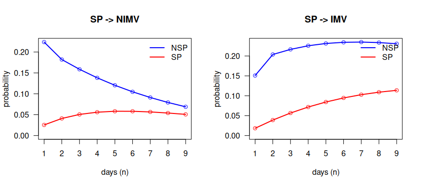
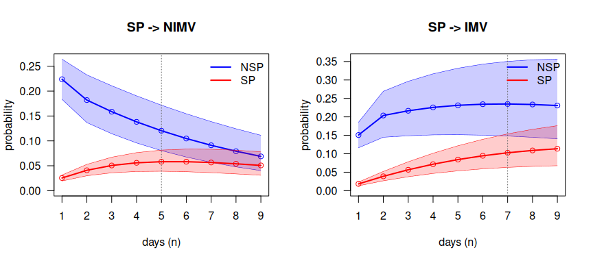
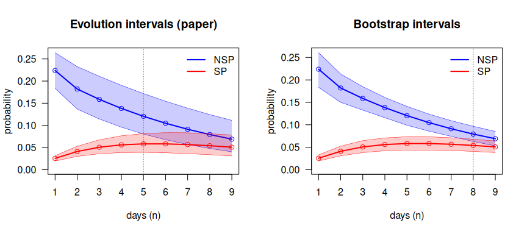

<!-- This vignette is precomputed: edit paper.Rmd.orig and run
     vignettes/precompile.R with the DIVINE data available. -->


This vignette reproduces, step by step, the real-data analysis of

> Najera-Zuloaga, J., Besalú, M. and Gómez Melis, G. (2025). Second-order
> Markov multistate models: nonparametric estimation and inference.
> Manuscript submitted for publication.

with `mstate2`. Each step names the part of the paper it reproduces, the
function that does it and the result to compare. A final checklist compares
the package output with the published values. The general use of every
function is explained in `vignette("mstate2")`.

| Paper | What it shows | Function | Section here |
|---|---|---|---|
| Data | daily panel of the DIVINE cohort | `sojourn_to_panel()`, `rnd()` | 2 |
| Counting processes | $\tilde N_{hj\ell}(s)$, $\tilde Y_{hj}(s-1)$ | `prep2()` | 3 |
| Eq. 9, Theorems 4–5 (Eqs. 13–14), Corollary 2 | relative probability estimator (RPE), variance, CI | `P2est()` | 4 |
| Table 2 | 1-step probabilities from severe pneumonia | `P2est()` | 4 |
| Eq. 6 | extended Chapman–Kolmogorov relation | `ckequations()` | 5 |
| Section 6.3, Figures 4–5 | for how long the previous state matters | `compare2()`, `overlap_step()` | 6 |
| Section 5, Table 1 (RPE rows) | simulation study of the estimator | `simulate2()`, `P2est()` | 8 |

Notation: $P_{hj\ell} = P(X_s = \ell \mid X_{s-1} = j, X_{s-2} = h)$, where $h$
is the state at the previous time, $j$ the state at the current time and
$\ell$ the state at the next time.

# 1. Data

The DIVINE cohort has 2076 patients hospitalised with COVID-19. The
multistate extract is distributed by the DIVINE project
([`msm_data/MSM_Data.RData`](https://github.com/bruigtp/DIVINE/tree/main/msm_data))
and is not included in `mstate2`: download it and load it.


```r
library(mstate2)
library(dplyr)
load("MSM_Data.RData")          # data frame MSM, one row per patient
```


```r
MSM |> summarise(patients = n(), discharged = sum(disch.s), died = sum(death.s))
#>   patients discharged died
#> 1     2076       1858  218
```

The states are non-severe and severe pneumonia (`NSP`, `SP`), non-invasive and
invasive mechanical ventilation (`NIMV`, `IMV`), recovery after respiratory
support (`Recov`), discharge (`Disch`) and death (`Death`). For each patient,
`MSM` records the days spent in each state (`t.nosp`, `t.sp`, `t.nimv`,
`t.mv`, `t.recov`) and how follow-up ended (`disch.s`, `death.s`).

# 2. Step 1: the daily panel

The methods of the paper are in discrete time: one observation per patient and
day. `sojourn_to_panel()` expands the days spent in each state into one row
per day, in the visiting order NSP → SP → NIMV → IMV → Recov, and appends the
final state.


```r
estados <- c("NSP", "SP", "Recov", "NIMV", "IMV", "Disch", "Death")
panel <- sojourn_to_panel(MSM, id = "id",
  segments  = c(NSP = "t.nosp", SP = "t.sp", NIMV = "t.nimv", IMV = "t.mv", Recov = "t.recov"),
  absorbing = c(Disch = "disch.s", Death = "death.s"))
dim(panel)
#> [1] 27736     3
```

Durations are recorded in half days. They are rounded with `rnd()`, the
rounding function of the paper's code, which sends 0.5 to 1. Base R's
`round()` sends 0.5 to 0, deletes the half-day stays in severe pneumonia and
does not reproduce Table 2:


```r
MSM |> filter(t.sp %% 1 == 0.5) |> nrow()    # half-day stays in SP
#> [1] 146
rnd(0.5); round(0.5)
#> [1] 1
#> [1] 0
```

# 3. Step 2: the second-order counting processes

`prep2()` forms, for every patient, the triples of consecutive days
$(X_{s-2}, X_{s-1}, X_s) = (h, j, \ell)$ and counts the transitions
$\tilde N_{hj\ell}(s)$ and the patients at risk $\tilde Y_{hj}(s-1)$.


```r
d <- prep2(panel, states = estados)
d
#> <msm2data>  second-order counting processes
#>   subjects        : 2076
#>   observed triples: 23584
#>   time range      : 0 - 138
#>   states (7)      : NSP, SP, Recov, NIMV, IMV, Disch, Death
#>   absorbing       : Disch, Death
#>   distinct (h,j)  : 12
```

The 23 584 triples are the 27 736 rows of the panel minus the first two days of
each patient, which have no complete history. The 12 histories $(h, j)$ are
the 5 stays in the same state and the 7 changes of state observed in the data.

# 4. Step 3: Table 2, the relative probability estimator

The RPE (Eq. 9) pools all the transitions and all the patient-days at risk of
each history:

$$
\tilde P_{hj\ell} = \frac{\sum_s \tilde N_{hj\ell}(s)}{\sum_s \tilde Y_{hj}(s-1)},
\qquad
\mathrm{se} = \sqrt{\frac{\tilde P_{hj\ell}(1-\tilde P_{hj\ell})}{\sum_s \tilde Y_{hj}(s-1)}},
$$

where the standard error is the square root of the variance estimator of
Theorem 5 (Eq. 14) divided by $n$, with Wald 95% confidence intervals
(Corollary 2) clipped to [0, 1], as in the paper's code.


```r
fit <- P2est(d)
table2 <- fit$estimate |>
  filter(j == "SP", l %in% c("NIMV", "IMV")) |>
  select(h, j, l, p, se, lower, upper, n.trans, at.risk)
table2
#> # A tibble: 4 × 9
#>   h     j     l          p      se  lower  upper n.trans at.risk
#>   <fct> <fct> <fct>  <dbl>   <dbl>  <dbl>  <dbl>   <int>   <int>
#> 1 NSP   SP    NIMV  0.224  0.0206  0.184  0.264       92     411
#> 2 NSP   SP    IMV   0.151  0.0177  0.116  0.185       62     411
#> 3 SP    SP    NIMV  0.0255 0.00305 0.0195 0.0315      68    2668
#> 4 SP    SP    IMV   0.0184 0.00260 0.0133 0.0235      49    2668
```

**Comparison with Table 2 of the paper:**


```r
published <- c(0.224, 0.151, 0.025, 0.018)        # NSP->NIMV, NSP->IMV, SP->NIMV, SP->IMV
table2 |>
  transmute(history = paste(h, j, sep = " -> "), to = l,
            paper = published, mstate2 = round(p, 3)) |>
  mutate(match = paper == mstate2)
#> # A tibble: 4 × 5
#>   history   to    paper mstate2 match
#>   <chr>     <fct> <dbl>   <dbl> <lgl>
#> 1 NSP -> SP NIMV  0.224   0.224 TRUE 
#> 2 NSP -> SP IMV   0.151   0.151 TRUE 
#> 3 SP -> SP  NIMV  0.025   0.025 TRUE 
#> 4 SP -> SP  IMV   0.018   0.018 TRUE
```

The four probabilities match to the three decimals published. A patient in
severe pneumonia who was in non-severe pneumonia at the previous time (who
has just worsened) moves to non-invasive ventilation the next day with
probability 0.224; one who was already in severe pneumonia, with probability
0.025. The 95% intervals of the two histories do not overlap, for NIMV or for
IMV:


```r
table2 |>
  group_by(to = l) |>
  summarise(separated = lower[h == "NSP"] > upper[h == "SP"])
#> # A tibble: 2 × 2
#>   to    separated
#>   <fct> <lgl>    
#> 1 NIMV  TRUE     
#> 2 IMV   TRUE
```

A first-order model, which ignores the state at the previous time, would give
the two patients the same probability.

# 5. Step 4: n-step prediction (extended Chapman–Kolmogorov)

The extended Chapman–Kolmogorov relation (Eq. 6) gives the probability of
being in each state $n$ days later, given the states at the previous and the
current time:
$P_{hj\ell}(1, n) = P(X_{n+1} = \ell \mid X_1 = j, X_0 = h)$.
`ckequations()` computes it exactly by treating the pair of consecutive
states as a first-order chain.

For a patient in SP at the current time who was in NSP at the previous time:


```r
round(ckequations(fit, h = "NSP", j = "SP", nsteps = 9), 3)
#>       NSP    SP Recov  NIMV   IMV Disch Death
#>  [1,]   0 0.616 0.007 0.224 0.151 0.000 0.002
#>  [2,]   0 0.532 0.067 0.182 0.204 0.001 0.015
#>  [3,]   0 0.460 0.132 0.159 0.217 0.005 0.028
#>  [4,]   0 0.398 0.183 0.138 0.226 0.015 0.040
#>  [5,]   0 0.344 0.220 0.120 0.231 0.032 0.052
#>  [6,]   0 0.298 0.247 0.105 0.234 0.054 0.063
#>  [7,]   0 0.257 0.264 0.091 0.235 0.079 0.074
#>  [8,]   0 0.222 0.275 0.079 0.234 0.106 0.084
#>  [9,]   0 0.192 0.279 0.069 0.231 0.135 0.094
```

Each row is the distribution of the state on day $n$ and sums to 1.

# 6. Step 5: for how long does the previous state matter? (Section 6.3)

`compare2()` computes the $n$-step curves for the two histories, NSP → SP and
SP → SP, with the **evolution intervals** of the paper, obtained by
propagating the lower and upper limits of the 1-step intervals.
`overlap_step()` returns the first day on which the two intervals overlap:
from then on, the state at the previous time no longer changes the prediction
significantly.


```r
cmp_nimv <- compare2(fit, h = c("NSP", "SP"), j = "SP", l = "NIMV", nsteps = 9)
cmp_imv  <- compare2(fit, h = c("NSP", "SP"), j = "SP", l = "IMV",  nsteps = 9)
summary(cmp_nimv)
#> Trajectory comparison (RPE, 95% evolution intervals)
#>   target 'NIMV' via current state 'SP'; preceding: NSP, SP
#>   intervals first overlap at step 5 (time s = 6); significant for the first 4 step(s).
summary(cmp_imv)
#> Trajectory comparison (RPE, 95% evolution intervals)
#>   target 'IMV' via current state 'SP'; preceding: NSP, SP
#>   intervals first overlap at step 7 (time s = 8); significant for the first 6 step(s).
```

These are the curves of Figures 4–5 of the paper, with its colours (blue
for NSP, red for SP at the previous time). Without intervals
(`bounds = FALSE`), the two histories start far apart and converge (the RPE
curves of Figure 4):


```r
op <- par(mfrow = c(1, 2))
plot(compare2(fit, c("NSP", "SP"), "SP", "NIMV", bounds = FALSE), col = c("blue", "red"),
     dualaxis = FALSE, xlab = "days (n)", main = "SP -> NIMV")
plot(compare2(fit, c("NSP", "SP"), "SP", "IMV", bounds = FALSE), col = c("blue", "red"),
     dualaxis = FALSE, xlab = "days (n)", main = "SP -> IMV")
```

<div class="figure" style="text-align: center">

<p class="caption">plot of chunk figure-curves</p>
</div>

```r
par(op)
```

With evolution intervals (Figure 5); the dotted line marks the first overlap:


```r
op <- par(mfrow = c(1, 2))
plot(cmp_nimv, col = c("blue", "red"), dualaxis = FALSE, xlab = "days (n)", main = "SP -> NIMV")
plot(cmp_imv,  col = c("blue", "red"), dualaxis = FALSE, xlab = "days (n)", main = "SP -> IMV")
```

<div class="figure" style="text-align: center">

<p class="caption">plot of chunk figure-intervals</p>
</div>

```r
par(op)
```


```r
tibble(target         = c("NIMV", "IMV"),
       first_overlap  = c(overlap_step(cmp_nimv)$n, overlap_step(cmp_imv)$n),
       separated_days = c(overlap_step(cmp_nimv)$separated_steps,
                          overlap_step(cmp_imv)$separated_steps))
#> # A tibble: 2 × 3
#>   target first_overlap separated_days
#>   <chr>          <int>          <int>
#> 1 NIMV               5              4
#> 2 IMV                7              6
```

The state at the previous time changes the prediction of non-invasive
ventilation for 4 days (the intervals overlap from day 5) and of invasive
ventilation for 6 days (from day 7). The paper reports the overlap "around
the fifth day" for NIMV and "between the sixth and seventh day" for IMV
(Section 6.3).

These curves are those of the paper's code: its `Chapman.Kolmogorov()`
function gives the same nine values for each history (differences below
$10^{-16}$), and the evolution limits differ by about $10^{-6}$ only because
the paper's code uses $z = 1.96$ and `mstate2` uses `qnorm(0.975)`.

# 7. Beyond the paper: bootstrap intervals

The evolution intervals assume that all the probabilities are at their lower
(or upper) limit at the same time, so they are conservative and widen with
$n$. `mstate2` adds percentile intervals from a bootstrap of whole patients,
`P2boot()`. This is **not part of the paper**; it is shown here to put the
evolution intervals in context.


```r
bt <- P2boot(d, B = 500, seed = 1)
cmp_b <- compare2(bt, h = c("NSP", "SP"), j = "SP", l = "NIMV", nsteps = 9)
overlap_step(cmp_b)$n
#> [1] 8
```


```r
op <- par(mfrow = c(1, 2))
plot(cmp_nimv, col = c("blue", "red"), dualaxis = FALSE, xlab = "days (n)", main = "Evolution intervals (paper)")
plot(cmp_b,    col = c("blue", "red"), dualaxis = FALSE, xlab = "days (n)", main = "Bootstrap intervals")
```

<div class="figure" style="text-align: center">

<p class="caption">plot of chunk figure-boot</p>
</div>

```r
par(op)
```

With bootstrap intervals the two histories of SP → NIMV remain separated for
7 days instead of 4.

# 8. Step 6: the simulation study (Section 5, Table 1)

Section 5 of the paper studies the estimators on data simulated from a
four-state model: states 1, 2 and 3 and an absorbing state A. Individuals
enter the study at different times through an auxiliary state 0 (probability
0.05 of entering state 1 and 0.05 of entering state 2 at each step), make a
first move with first-order probabilities and then move with second-order
probabilities until they are absorbed. The paper simulates 1,000 individuals
and repeats the study 100 times. `simulate2()` implements this mechanism,
with the probabilities of Section 5.1 written as a tensor `P[j, l, h]` and a
first-move matrix:


```r
st <- c("1", "2", "3", "A")
tensor <- array(0, c(4, 4, 4), dimnames = list(st, st, st))   # P[j, l, h]
tensor["2", c("2", "3"), "1"] <- c(0.4, 0.6)   # 1 -> 2 -> {2, 3}
tensor["3", c("3", "A"), "1"] <- c(0.1, 0.9)   # 1 -> 3 -> {3, A}
tensor["2", c("2", "3"), "2"] <- c(0.7, 0.3)   # 2 -> 2 -> {2, 3}
tensor["3", c("3", "A"), "2"] <- c(0.8, 0.2)   # 2 -> 3 -> {3, A}
tensor["3", c("3", "A"), "3"] <- c(0.5, 0.5)   # 3 -> 3 -> {3, A}
tensor["A", "A", ] <- 1                          # A is absorbing
first <- matrix(0, 4, 4, dimnames = list(st, st))
first["1", c("A", "2", "3")] <- c(0.1, 0.8, 0.1) # first move from state 1
first["2", c("2", "3")]      <- c(0.5, 0.5)      # first move from state 2
entry <- c("1" = 0.05, "2" = 0.05)               # entry from the auxiliary state 0
```

Table 1 reports one of the two probabilities of each history (the other is
its complement): $p_{123} = 0.6$, $p_{13A} = 0.9$, $p_{222} = 0.7$,
$p_{233} = 0.8$ and $p_{333} = 0.5$. Each replicate simulates 1,000
individuals and estimates them with `P2est()`:


```r
truth <- tibble(h    = c("1", "1", "2", "2", "3"),
                j    = c("2", "3", "2", "3", "3"),
                l    = c("3", "A", "2", "3", "3"),
                true = c(0.6, 0.9, 0.7, 0.8, 0.5))
one_replicate <- function(r) {
  sim <- simulate2(1000, tensor, first, entry = entry)
  P2est(prep2(sim, states = st, check.consecutive = FALSE))$estimate |>
    mutate(across(c(h, j, l), as.character)) |>
    inner_join(truth, by = c("h", "j", "l"))
}
set.seed(5)                                      # the seed of the paper's code
reps <- purrr::map(1:100, one_replicate) |>
  bind_rows(.id = "replicate")
```

The four measures of Table 1 are the mean squared error (MSE), the empirical
standard deviation of the 100 estimates (ESD), the average of the estimated
standard errors (ASD) and the coverage of the 95% intervals (CP):


```r
paper_table1 <- truth |>                         # RPE rows of Table 1
  mutate(paper_MSE = c(0.0008, 0.0020, 0.0001, 0.0002, 0.0002),
         paper_ESD = c(0.0274, 0.0444, 0.0121, 0.0123, 0.0130),
         paper_ASD = c(0.0245, 0.0420, 0.0125, 0.0134, 0.0132),
         paper_CP  = c(91, 91, 97, 97, 96))
table1 <- reps |>
  summarise(MSE = mean((p - true)^2), ESD = sd(p), ASD = mean(se),
            CP  = 100 * mean(lower < true & true < upper),
            .by = c(h, j, l, true)) |>
  left_join(paper_table1, by = c("h", "j", "l", "true"))
table1 |>
  transmute(probability = paste0("p", h, j, l, " = ", true),
            MSE = round(MSE, 4), paper_MSE, ESD = round(ESD, 4), paper_ESD,
            ASD = round(ASD, 4), paper_ASD, CP, paper_CP)
#> # A tibble: 5 × 9
#>   probability    MSE paper_MSE    ESD paper_ESD    ASD paper_ASD    CP paper_CP
#>   <chr>        <dbl>     <dbl>  <dbl>     <dbl>  <dbl>     <dbl> <dbl>    <dbl>
#> 1 p123 = 0.6  0.0006    0.0008 0.0256    0.0274 0.0244    0.0245    94       91
#> 2 p13A = 0.9  0.0016    0.002  0.0399    0.0444 0.04      0.042     89       91
#> 3 p222 = 0.7  0.0002    0.0001 0.0129    0.0121 0.0124    0.0125    93       97
#> 4 p233 = 0.8  0.0002    0.0002 0.0123    0.0123 0.0134    0.0134    97       97
#> 5 p333 = 0.5  0.0002    0.0002 0.013     0.013  0.0132    0.0132    95       96
```

The values agree with the RPE rows of Table 1 up to Monte Carlo error (100
replicates; the paper's code draws the transitions of the whole cohort as
binomial counts and `simulate2()` draws them individual by individual, so the
random numbers differ): the estimator is almost unbiased, the estimated
standard errors (ASD) match the observed variability (ESD), and the
coverage is close to 95%. The CPE rows of Table 1 are not reproduced,
because the package implements only the RPE.

# 9. Checklist

| Result | Paper | `mstate2` |
|---|---|---|
| P(NSP → SP → NIMV) | 0.224 | 0.224 |
| P(NSP → SP → IMV) | 0.151 | 0.151 |
| P(SP → SP → NIMV) | 0.025 | 0.025 |
| P(SP → SP → IMV) | 0.018 | 0.018 |
| First overlap of the evolution intervals, SP → NIMV | around day 5 | day 5 |
| First overlap of the evolution intervals, SP → IMV | between days 6 and 7 | day 7 |
| Table 1, ESD of the RPE of $p_{233}$ | 0.0123 | 0.0123 |
| Table 1, ASD of the RPE of $p_{233}$ | 0.0134 | 0.0134 |

The DIVINE checks (Table 2 and Section 6.3) also run as a script in
`tests/DIVINE_reproduction.R` whenever the DIVINE data are available.

# References

Najera-Zuloaga, J., Besalú, M. and Gómez Melis, G. (2025). Second-order Markov
multistate models: nonparametric estimation and inference. Manuscript
submitted for publication.

Besalú, M. and Gómez Melis, G. (2024). Second order Markov multistate models.
*SORT*, 48(2), 209–234.
